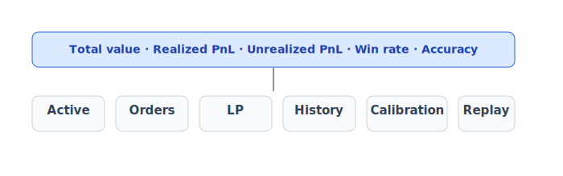
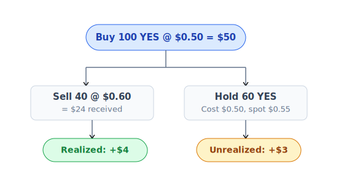

# Portfolio & P&L

Xem tất cả vị thế, history, P&L tại `/portfolio`.

## Màn hình tổng



## Active positions

Mỗi row:

| Market | Side | Balance | Avg cost | Spot | Unrealized P&L | Action |
|---|---|---|---|---|---|---|
| BTC > $100k trước 2027 | YES | 205.30 | $0.483 | $0.62 | +$28.20 | Sell / Redeem |
| ETH > $5k trong 2026 | NO | 50.00 | $0.380 | $0.42 | +$2.00 | Sell |

- **Balance**: số token YES/NO từ on-chain (indexer hydrate cost basis).
- **Avg cost**: bình quân gia quyền chi phí mua.
- **Spot**: giá kết hợp AMM v4 + best bid/ask CLOB (pricing layer).
- **Unrealized P&L**: `(spot - avgCost) × balance`.

## Realized vs unrealized P&L



- **Realized** = P&L đã đóng vị thế hoặc redeem.
- **Unrealized** = chưa chốt, phụ thuộc spot hiện tại.

## History — 6 loại

| Type | Mô tả | Source event |
|---|---|---|
| **Trade** | Buy/sell qua Router | `Router.Trade` |
| **Order** | Place/cancel/fill limit order | `Exchange.OrderPlaced/OrderMatched/OrderCancelled` |
| **Split** | Mint cặp YES+NO | `MarketFacet.PositionSplit` |
| **Merge** | Burn YES+NO → USDC | `MarketFacet.PositionMerged` |
| **Claim** | Redeem hoặc refund | `TokensRedeemed / MarketRefunded` |
| **LP** | Add/remove/collect liquidity | `PoolManager.ModifyLiquidity` |

Mỗi row click → tx hash trên explorer.

## Calibration — đo độ chính xác dự đoán

Áp dụng cho các market đã resolve.

### Brier score

Trung bình bình phương sai lệch giữa giá bạn mua và outcome thực tế.

```
Brier = mean[(outcome - your_buy_price)²]
```

Ví dụ:
- Bạn mua YES @ $0.70 → sự kiện xảy ra (outcome=1) → Brier = `(1 - 0.7)² = 0.09`
- Bạn mua NO @ $0.30 → sự kiện xảy ra → Brier = `(0 - 0.3)² = 0.09`

Score thấp = pricing đúng. Score cao = đoán sai thường xuyên.

### Accuracy band

Biểu đồ đo: khi bạn mua ở khoảng giá X, % sự kiện thực sự xảy ra là bao nhiêu?

| Bạn mua giá | Win rate thực tế | Đánh giá |
|---|---|---|
| `$0.30` (low confidence) | 30% | ✅ Well-calibrated |
| `$0.30` (low confidence) | 70% | ⬆️ **Underconfident** — bạn quá thận trọng, có thể trade size lớn hơn |
| `$0.70` (high confidence) | 70% | ✅ Well-calibrated |
| `$0.70` (high confidence) | 30% | ⬇️ **Overconfident** — bạn tự tin quá, nên trade nhỏ hơn |

App vẽ điểm của bạn trên biểu đồ scatter so với diagonal lý tưởng (mua $0.X → thắng X%). Càng gần diagonal càng pricing chính xác.

## Performance replay

Re-watch quyết định trade của bạn theo thời gian:

- Chọn period (7 ngày / 30 ngày / 90 ngày).
- Slider time-travel.
- Mỗi trade hiển thị: market state lúc đó, decision của bạn, kết quả về sau.
- Insight: bạn entry tốt hay vào quá sớm/muộn? Sell đỉnh hay panic out?

Tool dạy bạn nhận biết bias của chính mình.

## Streak & badge


Badge là NFT — sang shareable, profile signature. Chi tiết: [Rewards & gamification](../kinh-te/rewards.md).

## LP positions

Tab **Liquidity** trong portfolio:
- Mỗi row = 1 LP NFT.
- Hiện: pool, range, deposit value, current value, fee accrued, APR.
- Actions: **Collect** fee, **Add more**, **Remove**.

Chi tiết: [Liquidity provider](cung-cap-thanh-khoan.md).

## Export & API

- Tab **Export** → download CSV all history (cho mục đích tax / accounting).
- Developer lấy trực tiếp:
  - Indexer: `GET /api/users/:address/portfolio`
  - BE: `GET /api/v2/users/:address/portfolio`

## Sau endTime, chưa resolve

Market qua endTime nhưng chưa resolve:
- Trading đóng, không bán được.
- Unrealized = `cost basis × balance` (hold tới resolve).
- UI badge **Pending resolve**.
- Sau resolve → YES đúng $1, NO đúng $0 → P&L khép.

## Rebalance suggestion

App phân tích portfolio và gợi ý:
- Vị thế nào exposure quá lớn (concentration risk)?
- Market nào sắp endTime, có nên close trước?
- Limit orders nào đã stale (giá xa thị trường)?

Notification có thể bật/tắt trong [Settings](../tai-nguyen/settings-i18n.md).
