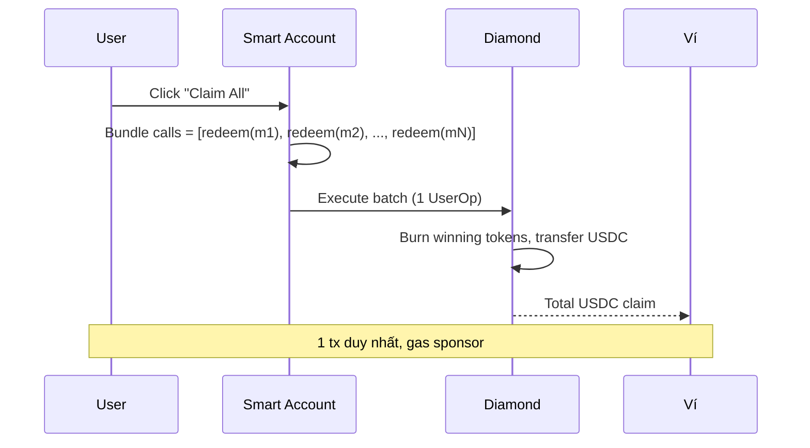
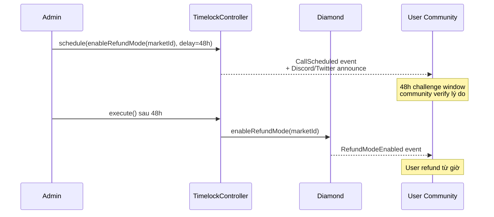

# Redeem & refund

Sau market resolve, đổi token thắng thành USDC. Nếu market không resolve được, dùng refund.

## Redeem — market đã resolve

**Điều kiện**:
- `market.isResolved == true`
- Bạn giữ token đúng phía (YES nếu outcome=true, NO nếu outcome=false)

### Bước

1. [Portfolio](portfolio.md) → filter **Resolved markets**.
2. Mỗi market có nút **Redeem** nếu bạn có token thắng.
3. Click → preview: số token, redemption fee, USDC nhận.
4. Confirm ví → ~2s tx complete.
5. USDC vào ví. Token thắng burn, token thua = $0.

### Batch redeem

Nhiều market đã resolve → nút **Claim All** → batch qua **passkey smart account** (1 click, 1 tx, gas qua paymaster — sponsor nếu đủ điều kiện). EOA user: từng market 1 tx riêng, tự trả gas (Wallet không hỗ trợ batch native).



### Công thức

```
payout = winningAmount × (10000 - redemptionFeeBps) / 10000
fee    = winningAmount - payout
```

Ví dụ: 205 YES đúng, fee 1% (100 bps):
```
payout = 205 × 9900 / 10000 = 202.95 USDC
fee    = 205 - 202.95       =   2.05 USDC
```

`redemptionFeeBps` snapshot tại creation, không đổi retroactively. Default 0% cho hầu hết market.

### Token thua

- **Không còn giá trị**.
- Không redeem được, không trade được (pool drained).
- Vẫn xuất hiện trong ví với balance, market value = $0. Hide bằng cách remove khỏi watchlist.

## Refund mode — market không resolve được

**Khi nào**: Oracle down, dispute hung, multisig không respond → admin enable refund mode qua timelock 48h.

**Điều kiện**:
- `market.refundModeActive == true`
- Bạn giữ **cả YES và NO**

### Bước

1. Portfolio → market hiển thị badge **Refund available**.
2. Click **Refund** → preview: `min(yesBalance, noBalance)`, USDC nhận.
3. Confirm → tx ~2s.
4. USDC về ví. Cặp YES+NO bị burn.

### Công thức

```
refundAmount = min(yesBalance, noBalance)
payout       = refundAmount USDC (1:1)
```

Ví dụ: bạn có 100 YES + 80 NO:
- Refund được 80 cặp → nhận 80 USDC.
- Còn dư 20 YES → **không có NO để pair**, không refund được.

### Cảnh báo: refund chỉ theo cặp

Nếu bạn chỉ có 1 phía (mua 100 YES qua Router, không giữ NO), bạn **không claim lại** được USDC qua refund flow đơn thuần.

**Giải pháp**:
- Mua NO từ ai đó còn bán (giá NO thường giảm gần $0 khi refund mode active vì không ai expect win).
- Pair với YES để refund.
- Loss tại giá mua NO.

### Đây là design trade-off

Refund mode ưu tiên **pro-rata công bằng** thay vì first-come-first-serve. Tránh trường hợp ai nhanh tay claim trước được, người sau không còn USDC.

Phase 2 (TBA): Có thể mở **single-sided refund** với haircut 50% — burn 100 YES → nhận 50 USDC. Đang trong governance discussion.

## Ai quyết định enable refund



- Admin multisig propose qua TimelockController.
- 48h delay — community challenge nếu sai.
- Auto executable sau 48h.

## Timing

- **Redemption window**: Vô thời hạn sau resolve.
- **Grace 365 ngày**: Sau đó admin có thể `sweepUnclaimed` thu hồi token chưa claim về treasury.
- **Refund window**: Vô thời hạn cho tới khi sweep (cũng 365 ngày).

Khuyến nghị claim trong 1 tháng để khỏi quên.

## Lỗi thường gặp

| Error | Lý do | Fix |
|---|---|---|
| "Market not resolved" | Qua endTime nhưng oracle chưa resolve | Chờ |
| "No winning tokens" | Có token thua | Không redeem được, accept loss |
| "Refund not active" | Market đang waiting hoặc đã resolved | Không phải mọi market đều refund |
| "Unequal YES/NO" | Refund chỉ theo cặp | Trade cân bằng số lượng, hoặc accept loss phần dư |
| "Sweep period passed" | Đã quá 365 ngày sau resolve | Token đã sweep về treasury, không claim được nữa |
