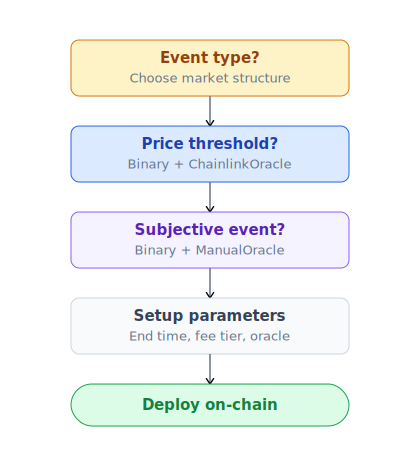
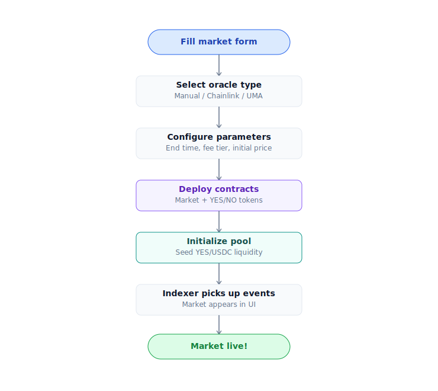

# Tạo market

Hướng dẫn cho **creator** (có `CREATOR_ROLE`) tạo market hoặc multi-outcome event.

## Ai có thể tạo

| Phase | Ai | Yêu cầu |
|---|---|---|
| **Phase 1** (hiện tại) | Address có `CREATOR_ROLE` | Whitelist qua governance proposal |
| **Phase 3** (TBA) | Permissionless | Stake bond **10,000 PRX** (refund khi market resolve clean, slash nếu malformed) |

Apply for `CREATOR_ROLE`: form on [Discord](../tai-nguyen/links.md) #creator-application + governance vote.

## Quyết định trước khi tạo



## Parameters cần quyết định

### Question

Câu hỏi chính của market — phải:
- **Cụ thể**: "BTC vượt $100,000 (USD) trên CoinGecko close 2027-01-01 UTC?" — không "BTC có cao không?"
- **Falsifiable**: Có thể trả lời chính xác YES/NO bằng nguồn objective.
- **Time-bound**: Có endTime rõ ràng.
- **No ambiguity**: Tránh "có thể", "khoảng", "gần".

### endTime

Timestamp market đóng trading + oracle window mở.

- Format: Unix seconds (UTC).
- Min: 1 giờ kể từ tạo (chống front-run).
- Max: 5 năm (UI cap).

### Oracle

| Oracle | Khi nào dùng | Setup cost |
|---|---|---|
| **ChainlinkOracle** | Price threshold | Free, register feed + threshold |
| **ManualOracle** | Subjective event | Free, multisig 3/5 sẽ resolve |
| **UMAOracle** (TBA) | Decentralized resolution | Bond $500-$50,000 USDC |
| **Custom adapter** | On-chain event (governance, TVL) | Deploy adapter, approve qua Diamond |

### Redemption fee

- Default: 0%.
- Có thể set 0-15% (cap on-chain).
- **Snapshot tại creation** — admin tăng default sau không ảnh hưởng market đã có.

### Per-market cap (optional)

Giới hạn tổng collateral lock trong market. Default = global cap (config protocol).

- Set 0 = unlimited.
- Set X = max X USDC collateral. Bảo vệ khi market quá rủi ro.

### Category + metadata

Off-chain metadata để UI hiển thị đẹp:
- **Title** (LocalizedString — vi/en/ja/ko)
- **Description**
- **Category**: crypto, sports, politics, weather, AI, …
- **Featured**: boolean
- **Image / icon**

Set qua admin BE endpoint sau khi tạo on-chain.

## Bước — tạo binary market với Chainlink



### Chi tiết

1. **Tạo on-chain market**:
   ```
   diamond.createMarket(
     question: "BTC vượt $100k trước 2027-01-01?",
     endTime: 1798752000,  // Unix sec
     oracle: ChainlinkOracle.address
   )
   ```
   Trả về `marketId` + addresses của YES, NO ERC-20 token.

2. **Register Chainlink feed**:
   ```
   chainlinkOracle.register(marketId, {
     feed: 0xA39434A63A52E749F02807ae27335515BA4b07F7,  // BTC/USD Unichain
     threshold: 100_000_000_000_000,  // $100k với 6 decimals + 8 decimals feed
     gte: true,                        // YES nếu price >= threshold
     snapshotAt: 1798752000            // = endTime
   })
   ```

3. **Register pool với Hook**:
   ```
   hook.registerMarketPool(marketId, {
     currency0: USDC,
     currency1: yesToken,
     fee: DYNAMIC_FEE_FLAG,            // hook quyết định
     tickSpacing: 60,
     hooks: PrediXHook.address
   }, yesIsCurrency0: false)
   ```

4. **Initialize pool v4** (tự động qua hook khi register).

5. **Seed liquidity ban đầu** (xem [Liquidity provider](cung-cap-thanh-khoan.md)).

6. **Set metadata** (UI title, category, image) qua BE admin endpoint:
   ```
   POST /api/v2/admin/markets/:id/display
   {
     title: { vi: "...", en: "...", ja: "...", ko: "..." },
     category: "crypto",
     image: "ipfs://...",
     isFeatured: false
   }
   ```

## Bước — tạo multi-outcome event

Event = container chứa N market con. Khi resolve, đúng 1 member YES = true, còn lại YES = false.

```
diamond.createEvent(
  name: "FIFA WC 2026 Winner",
  candidateQuestions: [
    "Argentina thắng?",
    "Brazil thắng?",
    "France thắng?",
    ...  // 48 đội
  ],
  endTime: 1789300000,  // sau final match
  oracle: ManualOracle.address
)
```

Trả về `eventId` + array `marketIds`. Mỗi member là binary market YES/NO bình thường + thuộc event.

Sau resolve event:
```
eventFacet.resolveEvent(eventId, winningIndex: 0)  // Argentina thắng
```

Atomic — tất cả members resolve cùng block, đúng 1 outcome = true.

## Best practices

- **Question wording**: Test với 5 người không hiểu context. Họ trả lời được YES/NO không?
- **endTime buffer**: Set sau event thực tế ít nhất 1-2h để dữ liệu finalize trước resolve.
- **Oracle source**: Cho ManualOracle, document nguồn primary trong description.
- **Liquidity seeding**: Min $500-$1000 USDC + corresponding YES/NO. Pool quá nông → user bỏ.
- **Featured marketing**: Coordinate với community team trước launch market lớn.

## Resolve dispute — bạn là creator

Nếu market resolve sai:
- **Phase 1 ManualOracle**: Bạn không phải multisig — flag trên Discord, multisig review. Nếu sai → enable refund mode.
- **Phase 2 UMAOracle**: Anyone propose dispute với bond.
- **Phase 1 ChainlinkOracle**: Resolve auto — chỉ dispute được nếu Chainlink feed bị manipulate, escalate via Chainlink direct.

## Revenue cho creator (Phase 3 — TBA)

Phase 3 sẽ có **creator revenue share** — % fee của market đó về creator. Currently 0%. Theo dõi roadmap.
