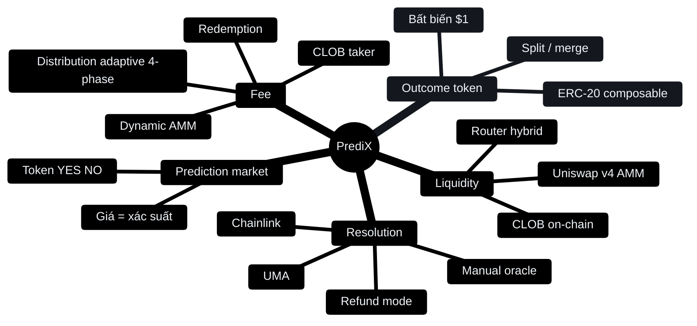

# Khái niệm

Hiểu PrediX hoạt động ra sao. Đọc theo thứ tự nếu mới, hoặc nhảy tới mục cần.

## Đọc theo thứ tự

- [Prediction market](prediction-market.md) — Giá = xác suất
- [Outcome token](outcome-tokens.md) — YES/NO, split/merge, bất biến $1
- [CLOB + AMM hybrid](clob-va-amm.md) — Order book on-chain + Uniswap v4 pool
- [Resolution & oracle](resolution.md) — Ai quyết định kết quả
- [Cấu trúc fee](phi.md) — AMM, CLOB, redemption, distribution

Cần tutorial từng bước (click chỗ nào, nhập gì) → [Hướng dẫn](../huong-dan/README.md).

Cần tech detail (smart contract, event, storage) → [Giao thức](../giao-thuc/README.md).
