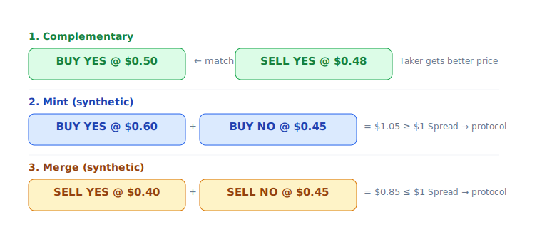
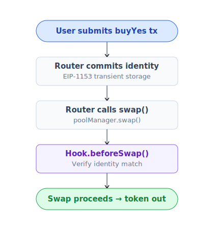

# CLOB + AMM hybrid

PrediX kết hợp 2 cơ chế liquidity: order book on-chain (CLOB) + Uniswap v4 pool (AMM). Router tự động chọn path tốt nhất trong cùng tx.

## Tại sao hybrid

| | CLOB only (Polymarket) | AMM only (Uniswap) | **Hybrid (PrediX)** |
|---|---|---|---|
| Trade nhỏ | OK nhưng slippage rộng nếu ít maker | Smooth, slippage thấp | Smooth + price improvement nếu có maker |
| Trade lớn | Phụ thuộc maker depth | Slippage tăng theo size | Drain CLOB trước, AMM phần còn lại |
| Maker incentive | Limit order (no fee) | Chỉ LP earn fee | **Cả 2** — maker đặt order, LP cung cấp liquidity |
| Giá công bằng | Maker tự set | AMM curve | AMM = floor, CLOB = price improvement |
| MEV protection | Order book khó frontrun | Pool dễ sandwich | Hook anti-sandwich + identity commit |

## Router — single entry point

Router là **stateless** — bất biến `balanceOf(router) == 0` enforce on-chain sau mỗi public call. Không lưu ký, không có funds stuck.

## CLOB — order book on-chain

Contract: `PrediXExchange`.

- **Tick size**: 99 mức giá $0.01, $0.02, …, $0.99. Lưu trên bitmap nén.
- **Limit order**: User chọn side (BUY_YES / SELL_YES / BUY_NO / SELL_NO), price, amount. Deposit token hoặc USDC bị lock tới khi khớp hoặc cancel.
- **Maker** đặt limit order chờ khớp. **Taker** ăn lệnh thị trường.

### 3 match type

- **Complementary**: BUY_YES ↔ SELL_YES cùng market. Phổ biến nhất.
- **Mint** (synthetic): BUY_YES + BUY_NO ≥ $1. Diamond mint cặp, đưa YES cho buyer YES, NO cho buyer NO. Spread → protocol.
- **Merge** (synthetic): SELL_YES + SELL_NO ≤ $1. Diamond burn cặp, trả USDC cho 2 seller. Spread → protocol.

Cả 3 đều thoả: **không ai bị thiệt**, mỗi side accept giá của mình.

## AMM — Uniswap v4 pool

Mỗi market có 1-2 v4 pool: YES-USDC và optional NO-USDC.

**PrediX Hook** plug vào v4:

| Callback | Chức năng |
|---|---|
| `beforeSwap` | Verify anti-sandwich identity (Router phải commit identity trước, Hook check qua transient storage EIP-1153) |
| `beforeAddLiquidity` | Chặn add LP nếu market resolved / refunded |
| `beforeRemoveLiquidity` | Track pool registration |
| `beforeDonate` | Chặn donate sau endTime (chống brute-force payout attack) |

Hook **không giữ tiền user dài hạn**. LP nhận LP token theo chuẩn v4 PositionManager. Chi tiết LP flow: [Cung cấp liquidity](../huong-dan/cung-cap-thanh-khoan.md).

## Khi nào Router prefer CLOB hơn AMM

Router **luôn** check CLOB trước:

1. CLOB có order với giá tốt hơn AMM spot → ăn CLOB.
2. Một phần CLOB, phần còn lại AMM nếu CLOB không đủ depth.
3. CLOB revert (không đủ token match, giá lệch) → Router skip, emit `ClobSkipped(reason)` event, fallback toàn bộ qua AMM.

User không cần care — Router luôn trả giá tốt nhất trong cùng tx.

## Tự trade trên AMM trực tiếp

Có thể. Pool YES-USDC là v4 pool bình thường — bạn swap qua UniversalRouter, Uniswap web, hoặc PoolManager trực tiếp.

**Nhưng**: bỏ qua CLOB liquidity → giá có thể kém hơn. Luôn dùng `PrediXRouter` để tận dụng cả 2.

## MEV protection

PrediX Hook implement **identity commit** chống sandwich attack:

MEV bot không thể frontrun + backrun trade của bạn trong cùng block — Hook revert nếu identity không match.
