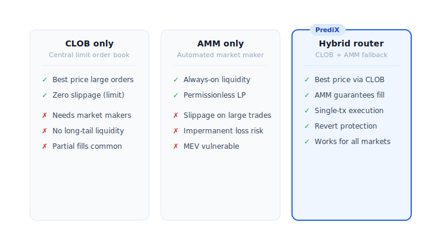
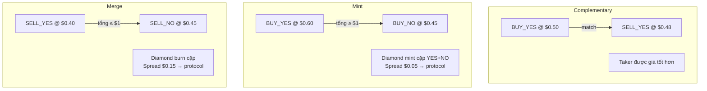

# CLOB + AMM hybrid

PrediX kết hợp 2 cơ chế liquidity: order book on-chain (CLOB) + Uniswap v4 pool (AMM). Router tự động chọn path tốt nhất trong cùng tx.

## Tại sao hybrid

| | CLOB only (Polymarket) | AMM only (Uniswap) | **Hybrid (PrediX)** |
|---|---|---|---|
| Trade nhỏ | OK nhưng slippage rộng nếu ít maker | Smooth, slippage thấp | Smooth + price improvement nếu có maker |
| Trade lớn | Phụ thuộc maker depth | Slippage tăng theo size | Drain CLOB trước, AMM phần còn lại |
| Maker incentive | Limit order (no fee) | Chỉ LP earn fee | **Cả 2** — maker đặt order, LP cung cấp liquidity |
| Giá công bằng | Maker tự set | AMM curve | AMM = floor, CLOB = price improvement |
| MEV protection | Order book khó frontrun | Pool dễ sandwich | Hook anti-sandwich + identity commit |

## Router — single entry point



Router là **stateless** — bất biến `balanceOf(router) == 0` enforce on-chain sau mỗi public call. Không lưu ký, không có funds stuck.

## CLOB — order book on-chain

Contract: `PrediXExchange`.

- **Tick size**: 99 mức giá $0.01, $0.02, …, $0.99. Lưu trên bitmap nén.
- **Limit order**: User chọn side (BUY_YES / SELL_YES / BUY_NO / SELL_NO), price, amount. Deposit token hoặc USDC bị lock tới khi khớp hoặc cancel.
- **Maker free, taker 0-1%** dynamic.

### 3 match type



- **Complementary**: BUY_YES ↔ SELL_YES cùng market. Phổ biến nhất.
- **Mint** (synthetic): BUY_YES + BUY_NO ≥ $1. Diamond mint cặp, đưa YES cho buyer YES, NO cho buyer NO. Spread → protocol.
- **Merge** (synthetic): SELL_YES + SELL_NO ≤ $1. Diamond burn cặp, trả USDC cho 2 seller. Spread → protocol.

Cả 3 đều thoả: **không ai bị thiệt**, mỗi side accept giá của mình.

## AMM — Uniswap v4 pool

Mỗi market có 1-2 v4 pool: YES-USDC và optional NO-USDC.

**PrediX Hook** plug vào v4:

| Callback | Chức năng |
|---|---|
| `beforeSwap` | Apply dynamic fee + verify anti-sandwich identity (Router phải commit identity trước, Hook check qua transient storage EIP-1153) |
| `beforeAddLiquidity` | Chặn add LP nếu market resolved / refunded |
| `beforeRemoveLiquidity` | Track pool registration |
| `beforeDonate` | Chặn donate sau endTime (chống brute-force payout attack) |

Hook **không giữ tiền user dài hạn**. LP nhận LP token theo chuẩn v4 PositionManager. Chi tiết LP flow: [Cung cấp liquidity](../huong-dan/cung-cap-thanh-khoan.md).

## Dynamic fee — tăng theo time-to-end

| Thời gian tới endTime | Phí AMM | Phí CLOB taker |
|---|---|---|
| > 7 ngày | 0.5% | 0% (bootstrap window) |
| 3-7 ngày | 1.0% | 0.5% |
| 1-3 ngày | 2.0% | 0.75% |
| < 24 giờ | 5.0% | 1.0% |

**Tại sao**: gần endTime, người có inside info trade nhiều hơn (toxic flow). LP cần spread rộng hơn để không lỗ. Fee cao = LP an tâm cung cấp liquidity tới phút cuối.

Chi tiết: [Cấu trúc fee](phi.md).

## Khi nào Router prefer CLOB hơn AMM

Router **luôn** check CLOB trước:

1. CLOB có order với giá tốt hơn AMM spot → ăn CLOB.
2. Một phần CLOB, phần còn lại AMM nếu CLOB không đủ depth.
3. CLOB revert (không đủ token match, giá lệch) → Router skip, emit `ClobSkipped(reason)` event, fallback toàn bộ qua AMM.

User không cần care — Router luôn trả giá tốt nhất trong cùng tx.

## Tự trade trên AMM trực tiếp

Có thể. Pool YES-USDC là v4 pool bình thường — bạn swap qua UniversalRouter, Uniswap web, hoặc PoolManager trực tiếp.

**Nhưng**: bỏ qua CLOB liquidity → giá có thể kém hơn. Luôn dùng `PrediXRouter` để tận dụng cả 2.

## MEV protection

PrediX Hook implement **identity commit** chống sandwich attack:

```mermaid
flowchart TD
    User(["👤 User tx: buyYes"])
    User --> S1["Router commitSwapIdentity(user, poolId)<br/>lưu vào transient storage EIP-1153"]
    S1 --> S2["Router gọi poolManager.swap(...)"]
    S2 --> S3["PoolManager call hook.beforeSwap(poolKey, params, sender)"]
    S3 --> Check{"Hook verify identity match?"}
    Check -->|✅ Match| Allow["Allow swap"]
    Check -->|❌ No identity<br/>(sandwich attacker)| Revert(["🛑 Revert · attacker fail"])
    Allow --> S4["PoolManager return delta cho Router"]
    S4 --> End(["✅ Token out về User"])

    classDef st fill:#2563eb,stroke:#1d4ed8,color:#fff,stroke-width:2px
    classDef step fill:#475569,stroke:#334155,color:#fff,stroke-width:1.5px
    classDef ok fill:#16a34a,stroke:#15803d,color:#fff,stroke-width:2px
    classDef bad fill:#dc2626,stroke:#b91c1c,color:#fff,stroke-width:2px
    class User st
    class S1,S2,S3,S4,Check,Allow step
    class End ok
    class Revert bad
```

MEV bot không thể frontrun + backrun trade của bạn trong cùng block — Hook revert nếu identity không match.
