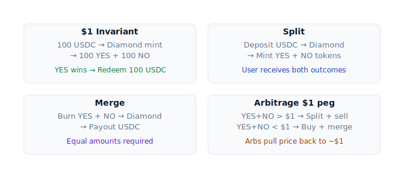

# Outcome token (YES / NO)

Mỗi market có 2 ERC-20 token. Hiểu chúng = hiểu cơ chế cốt lõi của PrediX.

## Đặc điểm

- Cả 2 đều là **ERC-20 chuẩn**, 6 decimals (giống USDC).
- Mỗi market có cặp YES/NO riêng — token YES của market A không dùng được ở market B.
- Mint chỉ bởi Diamond contract, không ai khác (`onlyFactory`).

## Bất biến cốt lõi — $1 invariant

```
YES.totalSupply == NO.totalSupply == market.totalCollateral
```

Tổng supply YES = Tổng supply NO = USDC đang lock trong market. **Luôn luôn**.



Đảm bảo: **khi resolve, protocol luôn đủ USDC trả người giữ token đúng**. Không thể insolvent.

## Split — mint YES + NO từ USDC

```
Bạn  ──deposit 100 USDC──▶  Diamond  ──mint 100 YES──▶  Bạn
                                      ──mint 100 NO───▶  Bạn
```

- Atomic: cả 3 step trong 1 tx.
- Free phí protocol. Gas mặc định user trả; sponsor cover nếu đủ điều kiện chương trình (áp dụng cả 2 account types).

**Khi nào dùng**:
- Market-make: bán YES và NO riêng với giá > $0.50 mỗi token (giá trung bình > $1, ăn spread).
- Arbitrage khi YES + NO > $1 trên thị trường.

## Merge — burn YES + NO → USDC

```
Bạn  ──burn 100 YES + 100 NO──▶  Diamond  ──payout 100 USDC──▶  Bạn
```

Ngược split. Cần giữ đủ cả 2 với số lượng bằng nhau.

**Khi nào dùng**:
- Có cả YES và NO (do trade), muốn rút.
- Arbitrage khi YES + NO < $1.

## Tại sao YES + NO luôn ≈ $1

Vì split / merge là **arbitrage riskless**:

- **YES + NO > $1**: Split 1 USDC → 1 YES + 1 NO → sell cả 2 tổng > $1 = profit. Nhiều người làm → giá bị kéo xuống ~$1.
- **YES + NO < $1**: Buy 1 YES + 1 NO < $1 → merge → 1 USDC = profit. Nhiều người làm → giá bị đẩy lên ~$1.

Arbitrage tự động bởi AMM bots, không cần người vận hành.

## Redeem — sau khi market resolve

- Market resolve, ví dụ outcome = YES.
- User giữ YES → call `redeem(marketId)` → mỗi 1 YES đổi 1 USDC (trừ redemption fee, default 0%).
- NO token → $0, không redeem được, không trade được nữa.

## Refund — khi market không resolve

Nếu oracle fail (down, dispute hung), admin enable **refund mode** qua timelock 48h:

- User burn cặp YES + NO → nhận USDC pro-rata.
- Burn theo `min(yesBalance, noBalance)` — chỉ refund được phần paired.

Chi tiết: [Resolution](resolution.md), [Redeem & refund](../huong-dan/redeem-va-claim.md).

## Composable với DeFi

Vì là ERC-20 standard, YES / NO có thể:

- Bỏ vào Uniswap pool khác (e.g. YES vs custom token).
- Dùng làm collateral lending (khi protocol lending list YES/NO).
- NFT mint condition (mint khi giữ YES của market resolve true).
- Vault strategy (e.g. auto-merge khi spread arbitrage).

ERC-20 standard → mọi protocol DeFi đều tương thích sẵn, không cần custom integration.

## Encoding chi tiết

- Amount 1 USDC = `1_000_000` (6 decimals base unit).
- Amount 1 YES = `1_000_000` (cũng 6 decimals).
- Price $0.48 = `480_000` (fixed-point 6 decimals). Range hợp lệ: `10_000` đến `990_000` (0.01 đến 0.99).

Detail integration: [developers/router-integration.md](../developers/router-integration.md).
