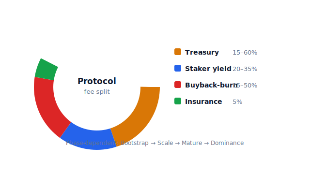
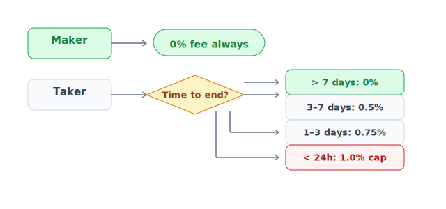
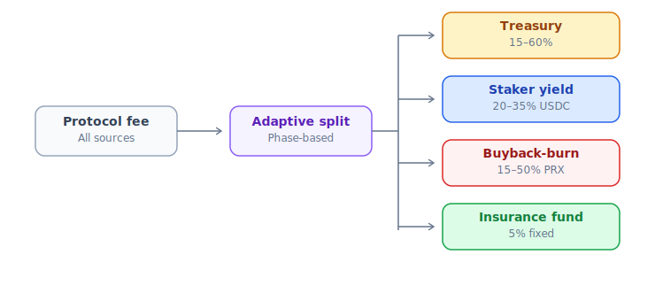

# Cấu trúc fee

PrediX có 4 loại fee. User thấy đầy đủ breakdown trước khi confirm tx.

## Tóm tắt



## 1. AMM swap fee — dynamic theo time-to-end

Áp dụng bởi Hook trên Uniswap v4 pool:

| Thời gian tới endTime | Phí AMM |
|---|---|
| > 7 ngày | **0.5%** |
| 3-7 ngày | **1.0%** |
| 1-3 ngày | **2.0%** |
| < 24 giờ | **5.0%** |

Phí trả bằng token in của swap.

**Tại sao dynamic**: Gần endTime, "toxic flow" (người có inside info) trade nhiều hơn. LP cần spread rộng hơn để không lỗ. Fee cao = LP an tâm cung cấp liquidity tới phút cuối.

Phân bổ AMM fee:
- **Phần lớn → LP** (reward cung cấp liquidity, không vào treasury)
- **Một phần → protocol** (cho buyback + staker + treasury)

## 2. CLOB fee



- **Maker**: 0% mãi mãi.
- **Taker**: 0-1% dynamic. Bootstrap window first 7 days post-launch là 0% để build liquidity.

## 3. Market creation fee

| Phase | Fee | Mục đích |
|---|---|---|
| **Phase 1** (admin + whitelist creator) | $10-50 USDC / market | Chống spam, fund audit |
| **Phase 3** (permissionless, TBA) | Bond 10,000 PRX | Refund khi market resolve clean, slash nếu malformed |

Fee → treasury.

## 4. Redemption fee

Phí khi redeem token thắng sau resolve.

- **Default**: 0% cho tới khi governance quyết định.
- **Cap on-chain**: **15%** (1500 bps) — invariant INV-4 hard enforce.
- **Snapshot tại creation**: Admin tăng default fee không ảnh hưởng market đã tồn tại. Tránh retroactive fee rug.

Công thức:
```
payout = winningAmount × (10000 - feeBps) / 10000
protocol_fee = winningAmount - payout
```

Ví dụ: Redeem 100 YES đúng, fee 1% (100 bps):
```
payout = 100 × 9900 / 10000 = 99 USDC
fee   = 100 - 99            =  1 USDC
```

## Phí bạn KHÔNG phải trả

- **Split** USDC → YES + NO: 0% phí protocol, chỉ gas.
- **Merge** YES + NO → USDC: 0%.
- **Cancel limit order**: 0%.
- **Refund mode claim**: 0%.
- **Sign-in / wallet connect**: 0% (không tx).

## Gas

Mặc định **cả 2 phương pháp wallet user đều tự trả gas**. PrediX có **chương trình sponsor gas** cho user đủ điều kiện (new user, stake holder ngưỡng nhất định, campaign event…) — **áp dụng cả 2 account types**, không phụ thuộc loại ví. Cơ chế cụ thể:

- **Passkey + Smart Account**: Gas trả qua paymaster contract. Đủ điều kiện sponsor → paymaster cover các action chính (swap, split, merge, redeem, place/cancel order) — UX hoàn toàn gasless.
- **Crypto wallet (EOA)**: Trả ETH trực tiếp. Đủ điều kiện sponsor → cơ chế rebate/refund off-chain (chi tiết công bố pre-launch). Gas Unichain rẻ — $0.001-0.01 per tx kể cả khi tự pay.

> Tiêu chí + duration sponsor program công bố pre-launch và có thể thay đổi theo governance vote. UI hiển thị "sponsored" badge khi tx được cover.

## Phí phân bổ — adaptive 4-phase

PrediX dùng **adaptive split** thay flat — % thay đổi theo growth phase:



| Phase | Treasury | Staker | Buyback | Insurance |
|---|---|---|---|---|
| **Bootstrap** | 60% | 20% | 15% | 5% |
| **Scale** | 25% | 30% | 40% | 5% |
| **Mature** | 20% | 35% | 40% | 5% |
| **Dominance** | 15% | 30% | 50% | 5% |

Phí thu từ AMM + CLOB taker + redemption + creation. LP fee trên AMM đi riêng — thuộc về LP, không chia về treasury.

Phase transition qua DAO vote dựa metric công khai. Detail:
- [Buyback-burn §Adaptive](../kinh-te/buyback-burn.md#adaptive-4-phase-split)
- [Staking real yield](../kinh-te/staking-real-yield.md)
- [vePRX gauge](../kinh-te/veprx-gauge.md)

## Ví dụ end-to-end

User mua 100 USDC YES trên market endTime còn 5 ngày:

```
| Path           | In        | Avg price | Out       | Fee paid      |
|----------------|-----------|-----------|-----------|---------------|
| CLOB taker     | 40 USDC   | $0.480    | 83.3 YES  | 0% bootstrap  |
| AMM swap       | 60 USDC   | $0.485    | 122.7 YES | 0.6 USDC (1%) |
| Tổng           | 100 USDC  | $0.483    | ~205 YES  | ~0.6 USDC     |
```

Sau resolve YES = true, redemption fee 1%:
```
Redeem 205 YES → 205 × 0.99 = 202.95 USDC
Lợi nhuận: 102.95 USDC
```

Nếu YES = false: mất 100 USDC, fee đã trả không refund.

## Fee discount cho staker

Stake PRX → giảm fee giao dịch (10-50% tuỳ ngưỡng stake). Chi tiết: [Staking §Fee discount](../kinh-te/staking-real-yield.md#fee-discount-cho-staker).
