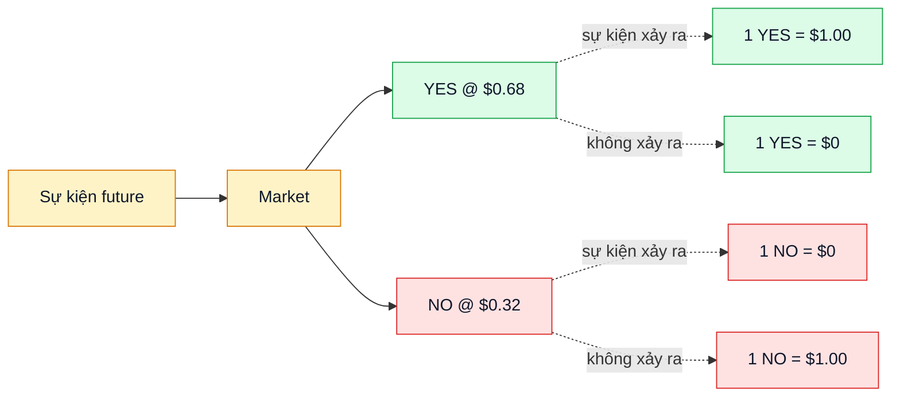

# Prediction market

Thị trường giao dịch token phản ánh **xác suất** một sự kiện xảy ra trong tương lai. Giá update realtime theo cung cầu.

## Ví dụ

Sự kiện: *"Bitcoin vượt $100,000 trước 2027-01-01?"*

- Giá YES = $0.68 → market đang pricing sự kiện **68% khả năng xảy ra**.
- Giá YES + Giá NO ≈ $1.00 (xem [Outcome token](outcome-tokens.md) tại sao).

## Tại sao giá là tín hiệu thông tin tốt

- Người tin sự kiện xảy ra → mua YES → đẩy giá lên.
- Tổng hợp ý kiến của nhiều người thành 1 con số minh bạch.
- **Skin in the game**: tiền thật → người trade chỉ thắng nếu đoán đúng. Mạnh hơn poll thông thường (người trả lời không mất gì).
- Nhiều nghiên cứu cho thấy prediction market thường chính xác hơn dự đoán chuyên gia ở các sự kiện có dữ liệu thống kê (bầu cử, sport, kinh tế vĩ mô).

## So với bookmaker truyền thống

| | Bookmaker (Bet365, 1xBet…) | Prediction market |
|---|---|---|
| Đối thủ đặt cược | House (sàn) | User khác (peer-to-peer) |
| Giá | House đặt, spread rộng | Market-driven, AMM + CLOB |
| Lưu ký tiền | House giữ (custodial) | Non-custodial, on-chain |
| Có thể sell trước resolve | Khó / không | Có — bán lại token bất cứ lúc nào |
| Audit được | Không | Có — explorer on-chain |
| Phí | Bao trong odds (5-15%) | Transparent fee (0.5-5% AMM, 0-1% CLOB) |
| Censorship | House có thể ban | Permissionless |

## Loại market trên PrediX

| Kind | Mô tả | Ví dụ |
|---|---|---|
| **Binary** | YES / NO đơn giản | "BTC > $100k trước 2027?" |
| **Scalar** | Long / short với strike, payout tuyến tính | "GDP Việt Nam 2026 (USD billion)?" — long > strike, short < strike |
| **Multi-outcome event** | N market con mutually-exclusive, đúng 1 win | "Ai thắng FIFA WC 2026?" — 48 đội, mỗi đội 1 market |
| **Sports** | Pre-structured cho giải đấu | Premier League season winner |
| **Grouped** | Nhóm market cùng theme | "AI capabilities milestones 2026" group |

Chi tiết multi-outcome: [Event đa outcome](../huong-dan/event-multi-outcome.md).

## Giới hạn của prediction market

- **Oracle dependence**: Cần nguồn report kết quả on-chain. Oracle có thể sai, dispute, hoặc chậm. PrediX dùng pluggable oracle để giảm rủi ro single point of failure. Xem [Resolution](resolution.md).
- **Liquidity**: Market không ai trade → spread rộng → slippage cao. Liquidity provider được incentive qua [gauge voting](../kinh-te/veprx-gauge.md).
- **Token chỉ có giá trong context market**: 1 YES của market A không dùng được ở market B. Sau resolve, token thua = $0.
- **Black swan events**: Sự kiện cực hiếm có thể không được pricing đúng. Thị trường tự correct theo thời gian khi info công khai.
