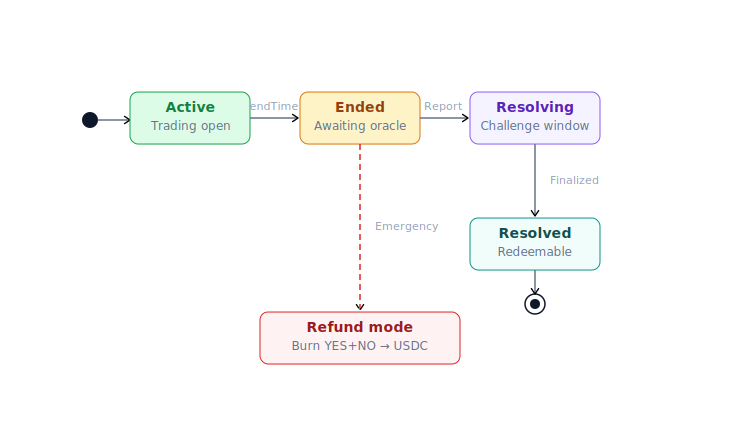
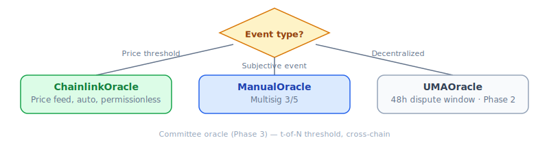
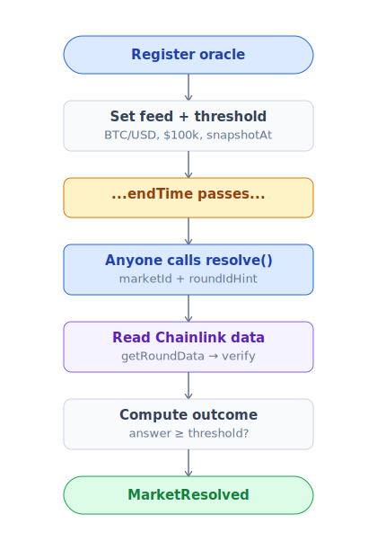
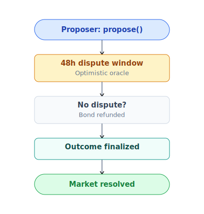

# Resolution & oracle

Một market cần nguồn *sự thật* để quyết định YES hay NO thắng. Nguồn đó là **oracle**.

## Lifecycle market

| Stage | Mô tả |
|---|---|
| **Created** | Creator (có `CREATOR_ROLE`) tạo market, đặt `endTime` + chọn oracle |
| **Trading** | User split / merge / trade tới `endTime` |
| **EndTime** | Trading đóng (hook chặn add liquidity + swap). Oracle window mở |
| **Resolved** | Oracle gọi `resolveMarket()` với outcome |
| **Redemption** | User giữ token đúng → redeem 1:1 USDC trừ fee |
| **RefundMode** | Fallback nếu oracle không resolve được (oracle down, dispute hung) |
| **Refunded** | User burn cặp YES+NO → nhận USDC pro-rata |

## 4 loại oracle

### ChainlinkOracle

Tự động, permissionless.

**Use case**: Price-threshold market (BTC, ETH, asset prices, FX rates).

### ManualOracle

Multisig 3/5 đọc kết quả từ nguồn off-chain, ký tx.

- Source: Reuters, AP, official API, on-chain data, video streaming.
- Outcome **immutable** sau khi set (invariant INV-6).
- Audit trail: `OracleReportCreated` event on-chain.

**Use case**: Sự kiện subjective (sport, election, debate winner).

**Risk mitigation**:
- HSM signer + role separation
- Public audit trail per signature
- Refund mode escape hatch nếu phát hiện sai sau

### UMAOracle (Phase 2 — TBA)

Permissionless propose + 48h dispute window.

**Bond sizing**: `max(min_bond, min(market_tvl × 0.5%, max_bond))`. Range $500 - $50,000 USDC.

**Use case**: Sự kiện cần decentralized resolution, không phụ thuộc multisig.

### Committee oracle (Phase 3 — TBA)

- t-of-N threshold signature (e.g. 5-of-9 validator).
- Commit-reveal voting prevent front-run.
- Slashing PRX nếu vote sai vs final consensus.
- Cross-chain via Wormhole / LayerZero.

**Use case**: Cross-chain governance outcome, complex composite event.

## So sánh

| | Manual | Chainlink | UMA | Committee |
|---|---|---|---|---|
| Ai resolve | Multisig 3/5 | Anyone | Anyone propose, DVM dispute | t-of-N validator |
| Subjective event | ✅ | ❌ | ✅ | ✅ |
| Dispute | Off-chain social | Không (data is law) | On-chain 48h | On-chain commit-reveal |
| Latency | Tức thì sau ký | Sau 1 round (~30s-1min) | 48h default | Sau commit-reveal cycle |
| Decentralization | Thấp | Trung bình | Cao | Cao |

## Refund mode — last resort

Khi không oracle nào resolve được → admin enable refund mode qua 48h timelock → user burn cặp YES+NO → nhận USDC pro-rata.

Chi tiết flow: [Oracle §Refund mode](../giao-thuc/oracle.md#refund-mode--last-resort) · [Redeem & refund](../huong-dan/redeem-va-claim.md).

## Resolve sai — làm gì

| Phase | Cơ chế |
|---|---|
| **Phase 1** (Manual) | Multisig discuss, social consensus. Nếu đa số đồng ý sai → enable refund mode |
| **Phase 2** (UMA) | Dispute qua UMA protocol, DVM vote |
| **Mọi phase** | Không bao giờ revert `isResolved=true` (INV-6 hard) |

## Ai có thể tạo market

- **Phase 1**: Address có `CREATOR_ROLE` (admin + whitelist creator).
- **Phase 3 (TBA)**: Permissionless — ai cũng tạo được nếu stake **bond PRX** (10k PRX proposed). Bond slash nếu market malformed hoặc resolve dispute.

Chi tiết: [Tạo market](../huong-dan/tao-market.md).

## Timing

- **Resolve window**: 7 ngày sau endTime. Chậm hơn → có thể trigger refund mode default.
- **Redemption**: Không deadline cứng, grace 365 ngày, sau đó admin có thể `sweepUnclaimed` về treasury.
- **UMA dispute**: 48h sau propose.

Time params config per-market hoặc global. Xem [Smart contracts](../giao-thuc/architecture.md).
