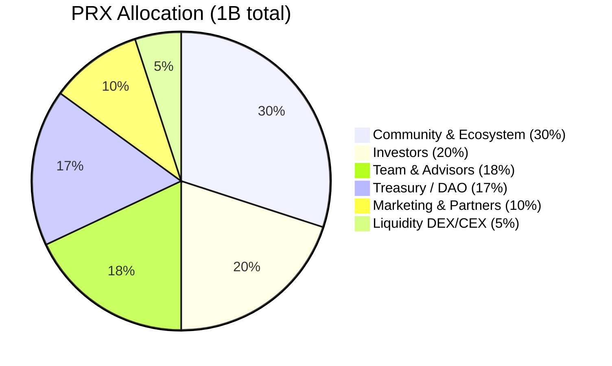
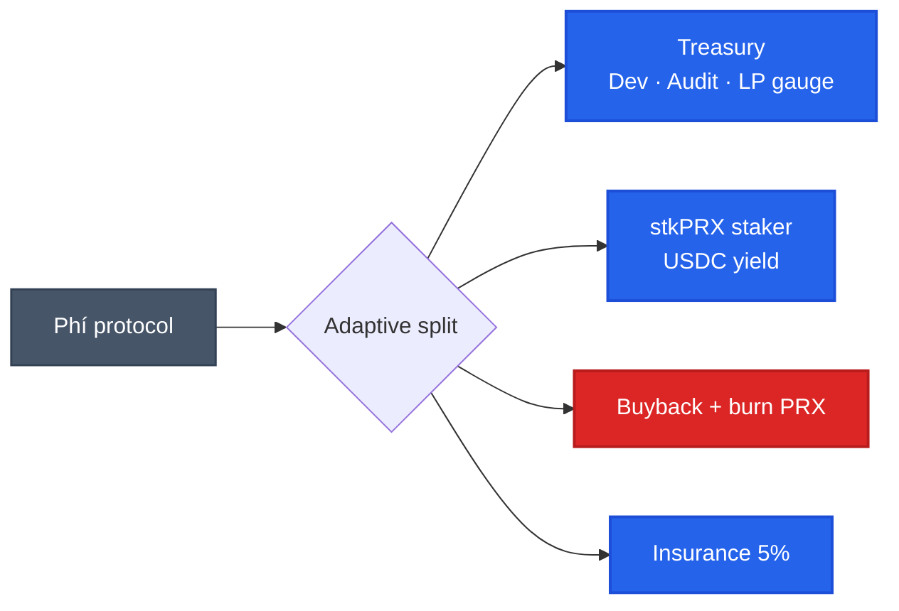

# PRX token & kinh tế

PRX là token quản trị + revenue share của PrediX. Hard cap **1 tỷ**, không mint thêm. ERC-20 trên Unichain.

## Token utility

- **Stake** → nhận share phí protocol bằng USDC (real yield, không emission)
- **Lock vePRX** → vote gauge, boost LP rewards 1.5-2.5×, protocol params governance
- **Fee discount** → stake threshold cho giảm 20-50% phí giao dịch
- **Market creation bond** → lock PRX để tạo permissionless market (Phase 2)
- **Oracle dispute** → lock PRX để challenge resolution sai

## Fee distribution — adaptive

Phí thu từ AMM + CLOB + redemption → chia theo growth phase:

| Phase | Treasury | Staker | Buyback-burn | Insurance |
|---|---|---|---|---|
| Bootstrap | 60% | 20% | 15% | 5% |
| Scale | 25% | 30% | 40% | 5% |
| Mature | 20% | 35% | 40% | 5% |
| Dominance | 15% | 30% | 50% | 5% |

Phase transition qua DAO vote. Detail: [Buyback-burn](buyback-burn.md).

## TGE — conditions-based

PrediX dùng conditions-based TGE (không time-based):

| Metric | Threshold |
|---|---|
| Monthly volume | ≥ $500K × 3 tháng liên tiếp |
| Weekly Active Traders | ≥ 1,000 × 3 tháng |
| Active markets | ≥ 10 × 3 tháng |
| Smart contract audit | 0 critical, 0 high |

## Đọc tiếp

| Topic | Page |
|---|---|
| Allocation, vesting, TGE circulating | [Allocation & vesting](allocation-vesting.md) |
| Staking USDC yield, fee discount, lock boost | [Staking real yield](staking-real-yield.md) |
| Lock → vePRX → vote → gauge → bribe | [vePRX & gauge](veprx-gauge.md) |
| Buyback-burn adaptive, treasury | [Buyback-burn](buyback-burn.md) |
| 6-season Points, referral program | [Points & seasons](points-seasons.md) |
| Badge, streak, daily challenge | [Rewards](rewards.md) |
