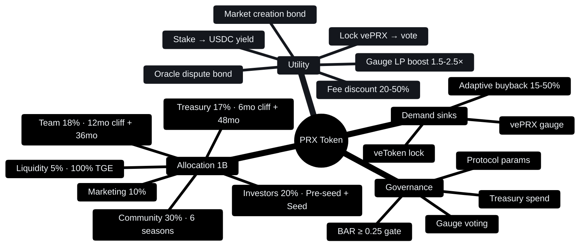
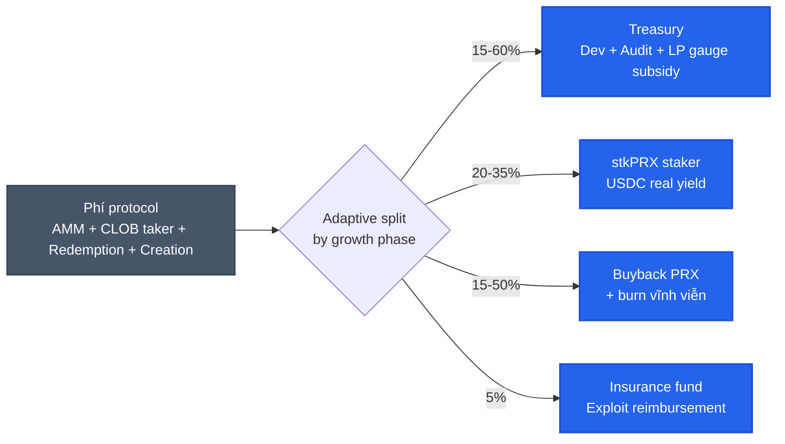

# PRX token & kinh tế

PRX là token quản trị + revenue share của PrediX. Hard cap **1 tỷ**, không mint thêm sau TGE. Hybrid utility (staking, fee discount, market creation bond, gauge vote) + governance.

## 5 câu hỏi cơ bản

| Câu hỏi | Tóm tắt | Đọc thêm |
|---|---|---|
| Token phân bổ ra sao? | 1B total · Community 30% · Investors 20% · Team 18% · Treasury 17% · Marketing 10% · Liquidity 5% | [Allocation & vesting](allocation-vesting.md) |
| Token có utility gì? | Stake USDC yield, lock vePRX vote, fee discount tier, market creation bond | [Staking real yield](staking-real-yield.md) |
| Governance hoạt động sao? | Lock PRX → vePRX → vote gauge + protocol params, BAR ≥ 0.25 gate | [vePRX & gauge](veprx-gauge.md) |
| Cơ chế gì hỗ trợ giá? | Adaptive 15-50% phí → buyback-burn, 5% insurance fund, deflationary post-Y4 | [Buyback-burn](buyback-burn.md) |
| Reward + Points từ user? | 6-season Points (S1=86M PRX), 2-phase referral, activity rewards | [Points & seasons](points-seasons.md) · [Rewards](rewards.md) |

## Pre-seed round (April 2026)

| | |
|---|---|
| **Raise** | $2,000,000 |
| **FDV pre-money** | $16,000,000 |
| **Token price** | $0.016 |
| **Tokens to all investors** | 200M (20%) — Pre-seed 125M + Seed 75M |
| **Pre-seed vesting** | 6mo cliff + 24mo linear, 8% TGE |
| **Min ticket** | $25K angel · $250K strategic · $500K lead |

Total Investors bucket = **20%** (Pre-seed 12.5% + Seed 7.5%, gộp lại "Investors" theo Opinion-style merged bucket).

## TGE — conditions-based

PrediX **không** time-based TGE. Token mint chỉ khi đạt 4 ngưỡng PMF gate liên tiếp 3 tháng:

| Metric | Threshold | Rationale |
|---|---|---|
| Monthly trading volume | ≥ $500K | PMF minimum viable |
| Weekly Active Traders | ≥ 1,000 | Organic user base |
| Active markets | ≥ 10 | Category diversity |
| Smart contract audit | 0 critical, 0 high | Security non-negotiable |

**Expected**: Q1-Q2/2027 (10-14 tháng post mainnet). Tránh OPN-style -62% TGE dump.

## Real yield, không inflation

Nhiều protocol pay staker bằng emission (mint token mới). PrediX pay bằng **phí thu thực tế bằng USDC**.

- Staker không nhận thêm PRX → nhận **USDC** từ phí protocol chia về.
- Không dilute supply. Emission near 0 sau 4 năm vest.
- Yield gắn với volume thật — protocol lỗ thì staker nhận ít, không ép phát hành.

Mô hình từ GMX, Pendle, Synthetix. Khác Aave / Lido (inflationary rewards).

## Adaptive fee distribution (4-phase)

PrediX dùng adaptive split theo growth phase, **không** flat 50/30/20:

| Phase | Treasury | Staker | Buyback | Insurance |
|---|---|---|---|---|
| **Bootstrap** (M+7 → break-even) | 60% | 20% | 15% | 5% |
| **Scale** (break-even → multi-chain) | 25% | 30% | 40% | 5% |
| **Mature** (Y3+) | 20% | 35% | 40% | 5% |
| **Dominance** (post-PMF, mature DAO) | 15% | 30% | 50% | 5% |

Bootstrap phase: ưu tiên treasury fund growth + insurance. Khi protocol đạt PMF + revenue đủ, shift sang buyback dominant + staker yield. Phase transition qua DAO vote dựa các metric (volume, runway, BAR).

> **BAR gate**: Buyback Absorption Ratio ≥ 0.25 — nếu BAR < 0.25 trong 2 tháng liên tiếp, DAO emergency vote (delay unlock hoặc tăng buyback %). Detail: [Buyback-burn](buyback-burn.md#bar-buyback-absorption-ratio).

## Phí throughput projection

| Volume/tháng | Fee mix dynamic | Revenue/năm | Buyback/năm (Scale phase 40%) | Staker yield/năm (30%) |
|---|---|---|---|---|
| $20M | 0.32% | $768K | $307K | $230K |
| $100M | 0.30% | $3.6M | $1.44M | $1.08M |
| $500M | 0.25% | $15M | $6M | $4.5M |
| $1B | 0.22% | $26M | $10.4M | $7.8M |

**Break-even volume**: ~$17.3M/tháng (true net 0.324% sau maker rebate + affiliate). Tham chiếu: Polymarket ~$10.57B/tháng, Kalshi ~$13.07B/tháng (March 2026, source: DeFi Rate). Market share to break-even = **0.073%**.

## Cảnh báo

- Tokenomics có thể adjust trước TGE dựa community feedback + governance.
- **Không phải pitch đầu tư** — đọc để hiểu cơ chế, không phải hứa ROI.
- DYOR. Đừng all-in.

## Đọc tiếp

- [Allocation & vesting](allocation-vesting.md) — chi tiết bucket, lock schedule, team sub-allocation, founder liquidity window
- [Staking real yield](staking-real-yield.md) — stkPRX, fee discount tier, lock boost
- [vePRX & gauge](veprx-gauge.md) — lock → vote → gauge → bribe market
- [Buyback-burn](buyback-burn.md) — adaptive 4-phase, BAR gate, insurance fund, treasury
- [Points & seasons](points-seasons.md) — 6-season emission (S1 86M Genesis), Points conversion, 2-phase referral
- [Rewards & gamification](rewards.md) — badge, streak, daily challenge, reward box
