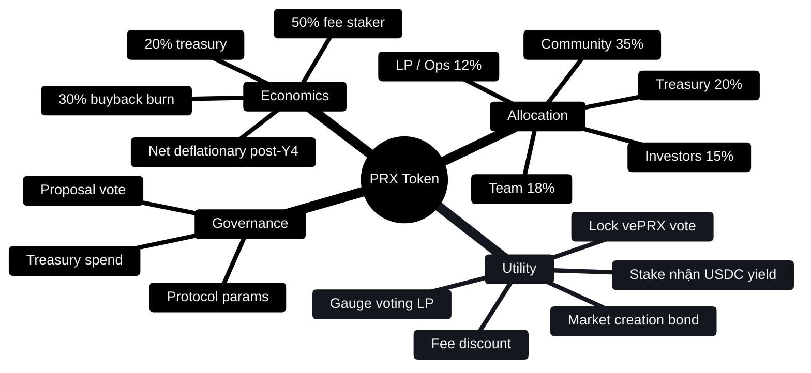
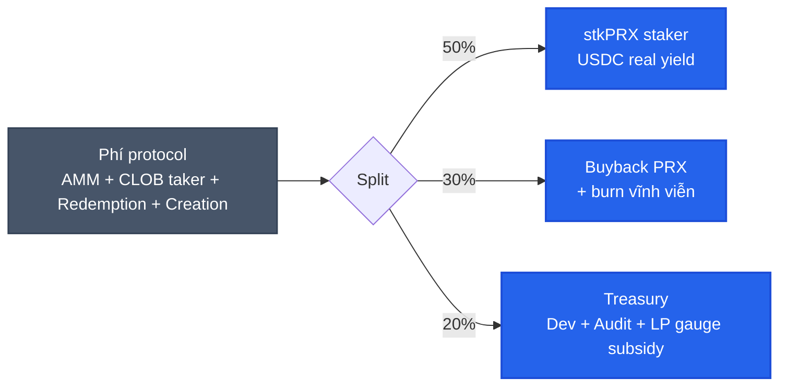

# PRX token & kinh tế

PRX là token quản trị + revenue share của PrediX.

## 4 câu hỏi cơ bản

| Câu hỏi | Tóm tắt | Đọc thêm |
|---|---|---|
| Token phân bổ ra sao? | 1B total, 35% community, 20% treasury, 18% team, 15% investor, 12% LP/ops | [Allocation & vesting](allocation-vesting.md) |
| Token có utility gì? | Stake USDC yield, vote governance, gauge vote, fee discount | [Staking real yield](staking-real-yield.md) |
| Governance thế nào? | Lock PRX → vePRX → vote gauge + protocol params | [vePRX & gauge](veprx-gauge.md) |
| Mechanic gì hỗ trợ giá? | 30% phí → buyback-burn, deflationary post-Y4 | [Buyback-burn](buyback-burn.md) |
| Reward + gamification cho user? | Streak, badge, daily challenge, leaderboard reward | [Rewards & gamification](rewards.md) |

## Real yield, không inflation

Nhiều protocol pay staker bằng emission (mint token mới). PrediX pay bằng **phí thu thực tế bằng USDC**.

- Staker 1000 PRX không nhận thêm PRX → nhận **USDC** từ phí protocol chia về.
- Không dilute supply. Emission near 0 sau 4 năm vest.
- Yield gắn với volume thật — protocol lỗ thì staker nhận ít, không ép phát hành.

Mô hình từ GMX, Pendle, Synthetix. Khác Aave / Lido (inflationary rewards).

## Phí flow tổng hợp

| Volume/tháng | Fee mix | Revenue/năm | Buyback PRX/năm | Staker yield/năm |
|---|---|---|---|---|
| $50M | 0.5% | $3M | $900k | $1.5M |
| $200M | 0.3% | $7.2M | $2.16M | $3.6M |
| $1B | 0.2% | $24M | $7.2M | $12M |

Break-even protocol: ~$140M volume / tháng. Thấp hơn đối thủ nhiều (Polymarket ~$500M-1B).

## Cảnh báo

- Tokenomics có thể adjust trước TGE dựa community feedback + governance.
- **Không phải pitch đầu tư** — đọc để hiểu cơ chế, không phải hứa ROI.
- DYOR. Đừng all-in.

## TGE timing

**TBA**. Theo dõi [Discord / Twitter chính thức](../tai-nguyen/links.md) cho announcement.

PMF gate trước TGE: $500k volume/tháng + 1000 trader unique + 10 markets active. Ensure protocol bền vững, không launch hấp tấp.
