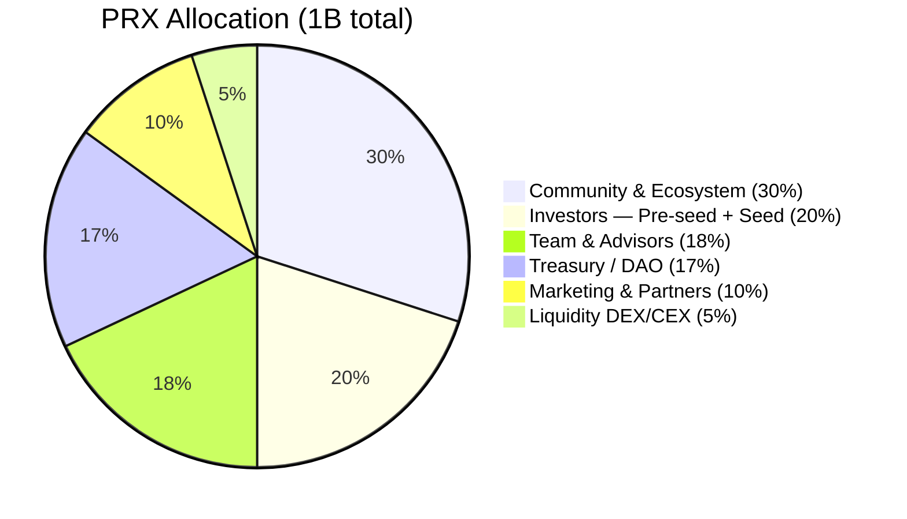
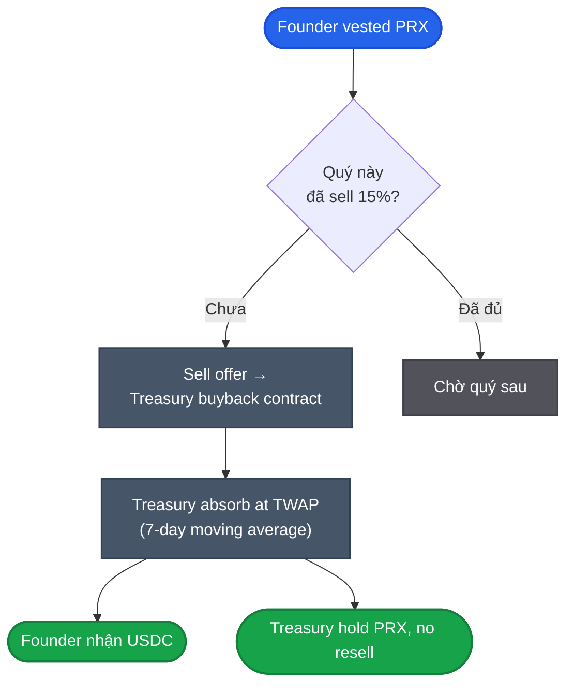

# Allocation & vesting

Total supply: **1,000,000,000 PRX** (1B). Hard cap, không mint thêm sau TGE. ERC-20 trên Unichain L2.

## Phân bổ



| Bucket | % | Tokens | TGE unlock | Cliff | Linear | Total vest | Ghi chú |
|---|---|---|---|---|---|---|---|
| **Community & Ecosystem** | 30% | 300M | 10% | 0 | 0 | 6 seasons (3 năm) | Season-based emission, S1=86M Genesis. Detail [Points & seasons](points-seasons.md). |
| **Investors (All Rounds)** | 20% | 200M | 8.8% weighted | 6 mo | 24 mo | 30 mo | Pre-seed 125M (8% TGE) + Seed 75M (10% TGE) |
| **Team & Advisors** | 18% | 180M | 0% (founders 5%) | 12 mo | 36 mo | 48 mo | Hybrid 36M, role-based sub-allocation. Founder liquidity window 15%/quarter. |
| **Treasury / DAO** | 17% | 170M | 0% | 6 mo | 48 mo | 54 mo | vePRX governance. Ops + audit + LP gauge subsidy. |
| **Marketing & Partners** | 10% | 100M | 5% | 3 mo | 24 mo | 27 mo | KOL, exchange listing, strategic partners |
| **Liquidity (DEX/CEX)** | 5% | 50M | 100% | 0 | 0 | 0 | Uniswap v4 + CEX bootstrap, full TGE |

Tham chiếu: Opinion (OPN) merged Seed + Pre-A vào single "Investors 23%" bucket. PrediX dùng same convention.

## Circulating tại TGE

**Total ~102.5M PRX (10.25%)** — healthy 10-15% range, low dilution to protect price post-TGE.

| Nguồn | Calc | Tokens |
|---|---|---|
| Pre-seed (8% of 125M) | 8% × 125M | 10M |
| Seed (10% of 75M) | 10% × 75M | 7.5M |
| Community (10% of 300M) | 10% × 300M | 30M |
| Marketing (5% of 100M) | 5% × 100M | 5M |
| Liquidity (100% of 50M) | 100% × 50M | 50M |
| Team (0% — full cliff) | 0% × 180M | 0 |
| Treasury (0% — full cliff) | 0% × 170M | 0 |
| **Total Circulating TGE** | | **102.5M (10.25%)** |

## Investors — round breakdown

Tách Pre-seed + Seed (gộp display "Investors 20%" theo Opinion-style):

| Round | Tokens | % of 1B | Token price | FDV | Raise | Vesting | TGE unlock |
|---|---|---|---|---|---|---|---|
| **Pre-seed** (current, April 2026) | 125M | 12.5% | $0.016 | $16M | $2M | 6mo cliff + 24mo linear | 8% |
| **Seed Strategic** (planned) | 75M | 7.5% | $0.04-0.067 | $40-67M | $3-5M | 3mo cliff + 15mo linear | 10% |
| **Total Investors** | 200M | 20% | — | — | $5-7M | — | — |

**Min ticket**: $25K angel (Zyner 2026 median angel $25-50K) · $250K strategic (Kruze 2026 median $100-250K) · $500K lead.

## Team vesting — hybrid 36M role-based

**18% (180M PRX) chia theo role**, không flat. Hybrid 36M base + acceleration cho founder.

| Role | % team | Tokens | Vesting | TGE unlock | Cliff | Linear | Note |
|---|---|---|---|---|---|---|---|
| **Founders** (3) | 50% | 90M | Hybrid 36M + acceleration | 5% | 12 mo | 24 mo | Performance tiers apply |
| **Core Team** (5-7) | 30% | 54M | 30M base | 3% | 6 mo | 24 mo | Senior eng, product, design |
| **New Hires Y2** (3-5) | 15% | 27M | 24M from join date | 0% | 6 mo | 18 mo | Hired sau mainnet |
| **Advisors** (3-5) | 5% | 9M | 18M | 5% | 3 mo | 15 mo | Legal, technical, market |
| **Total Team** | 100% | 180M | | weighted ~3.65% | | | |

### Founder liquidity window

Founders may sell **max 15%/quarter** of vested tokens via **Treasury buyback program**. Treasury absorbs at TWAP. VC-approved mechanism — orderly selling without market dumps.

Tránh founder sell vào market direct = tail risk price impact. Buyback program absorbs supply, market price unchanged.

## Lịch unlock

```mermaid
gantt
    title PRX vesting schedule (months from TGE)
    dateFormat X
    axisFormat %s
    section Community
    6 seasons (S1-S6)        :0, 36
    section Investors
    Pre-seed cliff 6m         :0, 6
    Pre-seed linear 24m       :6, 30
    Seed cliff 3m             :0, 3
    Seed linear 15m           :3, 18
    section Team
    Founders cliff 12m        :0, 12
    Founders linear 24m       :12, 36
    Core cliff 6m             :0, 6
    Core linear 24m           :6, 30
    section Treasury
    Cliff 6m                  :0, 6
    Linear 48m                :6, 54
    section Marketing
    Cliff 3m                  :0, 3
    Linear 24m                :3, 27
    section Liquidity
    100% TGE                  :0, 1
```



## Dilution per year (estimate)

| Year | % circulating cumulative | Note |
|---|---|---|
| 0 (TGE) | ~10.25% | Low circ, light float |
| 1 | ~25-30% | Investors start vest, S2 unlock, Treasury start |
| 2 | ~50-55% | Most investor vest done, Team start vest |
| 3 | ~75% | Team mid-way, Treasury mid-way, S3-S4 emission |
| 4 | ~90% | Team done, Treasury near complete |
| 5+ | 100% | Fully circulating |

Adaptive buyback (15-50% revenue) absorbs portion of new emission — net dilution lower than gross emission. **BAR ≥ 0.25** governance gate ensures sell pressure không vượt buyback absorption (xem [Buyback-burn](buyback-burn.md#bar-buyback-absorption-ratio)).

## TGE — conditions-based (NOT time-based)

Khác hầu hết DeFi protocol (time-based TGE), PrediX dùng **conditions-based TGE** để tránh OPN-style -62% dump:

| Metric | Threshold | Duration | Rationale |
|---|---|---|---|
| Monthly trading volume | ≥ $500K | 3 tháng liên tiếp | PMF minimum viable |
| Weekly Active Traders | ≥ 1,000 | 3 tháng liên tiếp | Organic user base |
| Active markets | ≥ 10 | 3 tháng liên tiếp | Category diversity |
| Smart contract audit | 0 critical, 0 high | Trước TGE | Security non-negotiable |

**Expected TGE**: Q1-Q2/2027 (10-14 tháng post mainnet). Nếu không đạt — defer TGE, tiếp tục Points S1, không launch hấp tấp.

## Anti-sybil & distribution rules

- **Không** private sale sau Seed. Tiếp theo là TGE public.
- **Community emission**: Season-based, Sybil detection + volume-weighted + cap per wallet (xem [Points & seasons](points-seasons.md#anti-gaming)).
- **OTC Seed/Pre-seed**: Chỉ ký với address KYC, vesting contract enforce non-transferable trong cliff.
- **Vesting transparent**: Mọi vest contract public, addresses của team + investor lock public — community track unlock schedule realtime.

## So với benchmarks

| Protocol | Community | Team | Investor | TGE Circulating | Cliff team |
|---|---|---|---|---|---|
| **PrediX** | **30%** | **18%** | **20%** | **10.25%** | **12 mo (founders)** |
| Opinion (OPN) | 34.6% | 19.5% | 23% | ~12% | 12 mo |
| Hyperliquid (HYPE) | 31% (genesis) | 23.8% | 0% (no VC) | ~33% | 12 mo |
| Polymarket | N/A (no token) | — | — | — | — |
| Curve | 62% | 30% | 30% | ~5% | 1 năm |
| Aave | 30% | 15% | 17% | ~13% | 6 mo |
| GMX | 50% | 25% | 25% | ~9% | 6 mo |

PrediX choose:
- **Community 30%** — vừa đủ incentive, không quá lỏng như Curve/GMX. Tham chiếu Opinion 34.6%, ít hơn nhưng có 6-season catalyst.
- **Team cliff 12 mo + 36 mo linear** — industry standard, founders 5% TGE để align incentive ngay từ đầu.
- **Investors 20%** — gấp Aave (17%), bằng Opinion (23%, sau merge). Pre-seed nhỏ ($2M raise) giữ FDV thấp ($16M) cho fair launch.
- **Liquidity 5% riêng** — bootstrap DEX/CEX healthy, không phụ thuộc community pool.
- **Marketing 10% riêng** — KOL incentive + exchange listing có budget rõ.

## Smart contract vesting

Vest contract = OpenZeppelin `VestingWallet` clone, audit cùng core protocol.

- Beneficiary có thể `release()` token đã vest bất cứ lúc nào.
- View `releasable()` để check số token sẵn sàng claim.
- Address vest contract public — track unlock realtime trên dashboard.

Indexer track unlock event, surface trên public dashboard ([Dune](../tai-nguyen/links.md)).

## Founder liquidity contract — Treasury buyback program



- Cap 15%/quý vested tokens
- Buyback at TWAP 7-day → no price spike
- Treasury hold PRX (không re-sell), supply effectively reduced from circulation
- Public on-chain — voter track founder sell history qua Treasury contract

## API

```
GET /api/v2/tokenomics/allocation         # bucket breakdown + circulating
GET /api/v2/tokenomics/vesting             # all vest contracts + readyAt
GET /api/v2/tokenomics/founder-liquidity  # founder sell history via Treasury
```

Chi tiết: [API reference](../developers/api-reference.md#backend-endpoints-v2).
