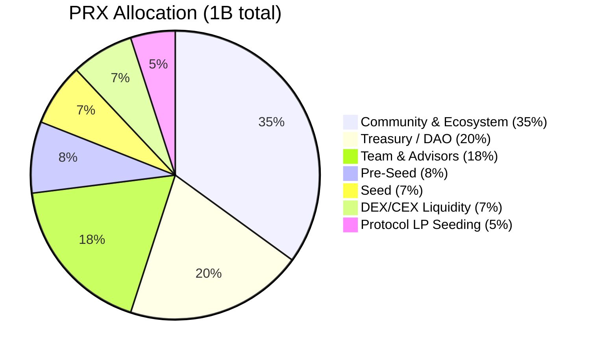

# Allocation & vesting

Total supply: **1,000,000,000 PRX** (1B). Không mint thêm sau TGE.

## Phân bổ

| Nhóm | % | Tokens | Vesting | Ghi chú |
|---|---|---|---|---|
| **Community & Ecosystem** | 35% | 350M | 48 tháng linear emission, unlock theo gauge vote milestone | Incentive user, LP, creator |
| **Treasury / DAO** | 20% | 200M | 4 năm linear, governance-controlled | Fund dev, audit, grants |
| **Team & Advisors** | 18% | 180M | 12 tháng cliff + 36 tháng linear | Core team + advisor |
| **Pre-Seed** | 8% | 80M | 6 tháng cliff + 18 tháng linear, 10% TGE unlock | SAFT holders |
| **Seed Strategic** | 7% | 70M | 3 tháng cliff + 15 tháng linear, 10% TGE unlock | Strategic partners |
| **DEX/CEX Liquidity** | 7% | 70M | 50% TGE + 50% 12 tháng linear | Bootstrap thanh khoản exchange |
| **Protocol LP Seeding** | 5% | 50M | Unlock theo milestone volume | Seed AMM pool cho PrediX markets |

## Circulating supply tại TGE

Dự kiến **~12-15%** circulating (140-150M PRX):

| Nguồn | TGE unlock | Tokens |
|---|---|---|
| Pre-Seed (10% of 80M) | 10% | 8M |
| Seed (10% of 70M) | 10% | 7M |
| DEX/CEX (50% of 70M) | 50% | 35M |
| Community first distribution | Init | ~50M |
| Treasury initial unlock | Init | ~40M |
| **Tổng** | | **~140M** |

Dilution thấp so với industry standard (20-25% TGE phổ biến). Goal: protect price từ sell pressure ngay sau TGE.

## Lịch unlock

```mermaid
gantt
    title PRX vesting schedule (months from TGE)
    dateFormat X
    axisFormat %s
    section Community
    Emission 48m linear      :0, 48
    section Treasury
    Linear 4 năm             :0, 48
    section Team
    Cliff 12m                :0, 12
    Linear 36m               :12, 48
    section Pre-Seed
    Cliff 6m                 :0, 6
    Linear 18m               :6, 24
    section Seed
    Cliff 3m                 :0, 3
    Linear 15m               :3, 18
    section DEX/CEX
    50% TGE                  :0, 1
    50% linear 12m           :0, 12
```

## Dilution per year

| Year | % circulating cumulative | Note |
|---|---|---|
| 0 (TGE) | ~12% | Low circ, light float |
| 1 | ~30% | Team start vest, community scale |
| 2 | ~55% | Most investor vest done |
| 3 | ~80% | Team done, community emission winding |
| 4 | ~95% | Treasury near complete |
| 5+ | 100% | Fully circulating |

## Team vesting hard

- **12 tháng cliff**: Không nhận gì 12 tháng đầu sau TGE.
- **36 tháng linear**: Vest hàng block sau cliff.
- **No emergency unlock**: Vesting contract on-chain, verifiable, không bypass.
- **Founders**: Không có allocation ngoài team pool.

Áp dụng team + advisors.

## Lock bonus tại TGE

Bonus APY cho ai lock sớm trong 30 ngày đầu post-TGE:

| Lock | Yield boost | vePRX weight |
|---|---|---|
| 6 tháng | +10% USDC yield | 0.5× |
| 12 tháng | +25% USDC yield | 1.0× |
| 24 tháng | +50% USDC yield | 2.0× |
| 48 tháng | +75% USDC yield | 4.0× |

Chi tiết: [vePRX & gauge](veprx-gauge.md).

## Anti-sybil & distribution rules

- **Không có private sale sau Seed**. Tiếp theo là TGE public.
- **Airdrop community**: Testnet points → PRX theo formula công bố trước TGE. Cap per wallet để chống sybil.
- **OTC Seed/Pre-Seed**: Chỉ ký với address KYC, không transfer được trong cliff (vesting contract enforce).
- **Vesting transparent**: Mọi vest contract public, addresses của team + investor lock public — community track được unlock schedule.

## So với benchmarks

| Protocol | Community % | Team % | Investor % | Cliff team |
|---|---|---|---|---|
| **PrediX** | **35%** | **18%** | **15%** | **12 tháng** |
| Uniswap | 60% (giant airdrop) | 21% | 18% | None (vested directly) |
| Curve | 62% | 30% | 30% | 1 năm |
| Aave | 30% | 15% | 17% | 6 tháng |
| GMX | 50% | 25% | 25% | 6 tháng |

PrediX choose:
- **Community 35%** — vừa đủ incentive, không quá lỏng như Uniswap.
- **Team cliff 12 tháng** — dài hơn industry, giảm rủi ro team dump sớm.
- **Investor 15%** — nhỏ, giữ phần lớn cho community + treasury.

## Smart contract vesting

Vest contract = OpenZeppelin `VestingWallet` clone, audit cùng core protocol.

- Beneficiary có thể `release()` token đã vest bất cứ lúc nào.
- View `releasable()` để check số token sẵn sàng claim.
- Address vest contract public — track unlock realtime trên dashboard.

Indexer track unlock event, surface trên public dashboard ([Dune](../tai-nguyen/links.md)).
