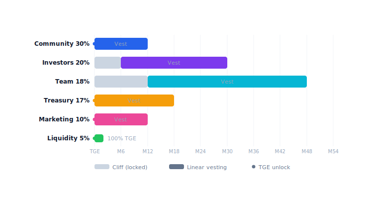

# Allocation & vesting

Total supply: **1,000,000,000 PRX** (1B). Hard cap, không mint thêm sau TGE.

## Phân bổ

| Bucket | % | Tokens | TGE unlock | Cliff | Linear vest |
|---|---|---|---|---|---|
| **Community & Ecosystem** | 30% | 300M | 10% | — | 6 seasons (3 năm) |
| **Investors (All Rounds)** | 20% | 200M | ~9% | 3-6 mo | 15-24 mo |
| **Team & Advisors** | 18% | 180M | 0% | 12 mo | 36 mo |
| **Treasury / DAO** | 17% | 170M | 0% | 6 mo | 48 mo |
| **Marketing & Partners** | 10% | 100M | 5% | 3 mo | 24 mo |
| **Liquidity (DEX/CEX)** | 5% | 50M | 100% | — | — |

## Circulating tại TGE

~**102.5M PRX (10.25%)** — low float design.

| Nguồn | Tokens |
|---|---|
| Community (10% of 300M) | 30M |
| Liquidity (100% of 50M) | 50M |
| Investors (~9% weighted) | 17.5M |
| Marketing (5% of 100M) | 5M |
| Team + Treasury (0%) | 0 |
| **Total** | **102.5M** |

## Lịch unlock

## Community — 6-season emission

300M PRX chia 6 seasons trên 3 năm, declining ~30%/season:

| Season | Pool | Timeline | Theme |
|---|---|---|---|
| S1 Genesis | 86M | M1-M6 | Mainnet launch · Points → PRX at TGE |
| S2 Growth | 60M | M7-M12 | Fee ON · TGE · staking rewards |
| S3 Scale | 43M | M13-M18 | Multi-chain · market creation |
| S4 Mature | 30M | M19-M24 | DAO governance · institutional |
| S5 Expand | 21M | Y3 H1 | Regional expansion |
| S6+ Reserve | 60M | Y3+ | DAO-locked (emergency / partnership) |

S1 = lớn nhất vì cold-start hardest. Detail: [Points & seasons](points-seasons.md).

## Team vesting

- **12 tháng cliff** — không nhận gì 12 tháng đầu sau TGE.
- **36 tháng linear** — vest hàng block sau cliff.
- **No emergency unlock** — vesting contract on-chain, verifiable.
- Vest contract = OpenZeppelin `VestingWallet` clone, audit cùng core protocol.
- Address vest contract public — community track unlock realtime.

