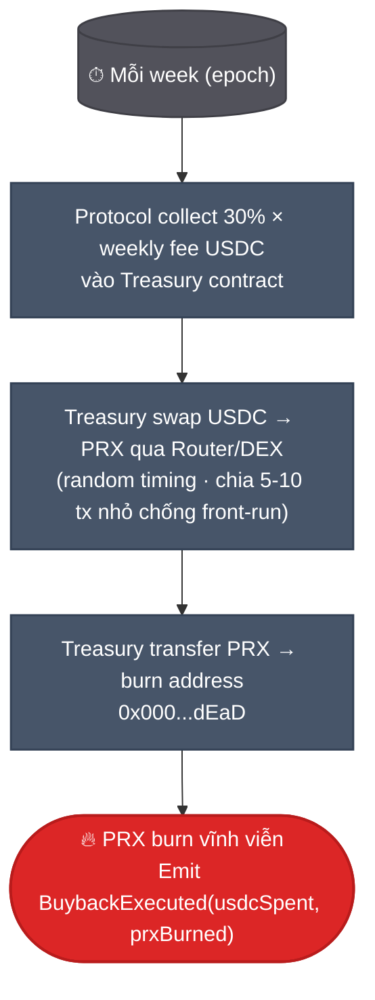
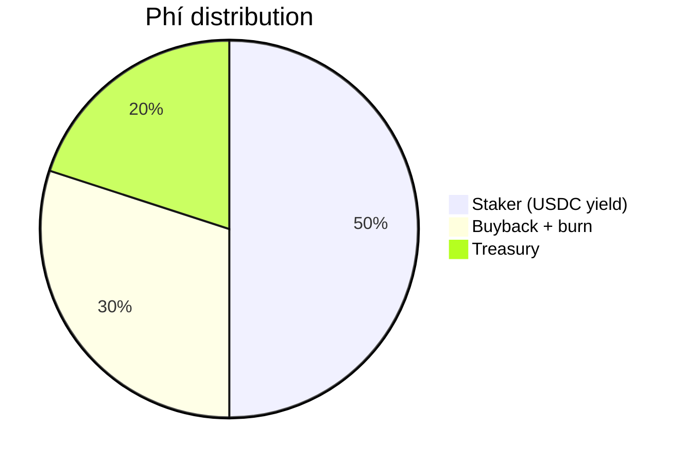
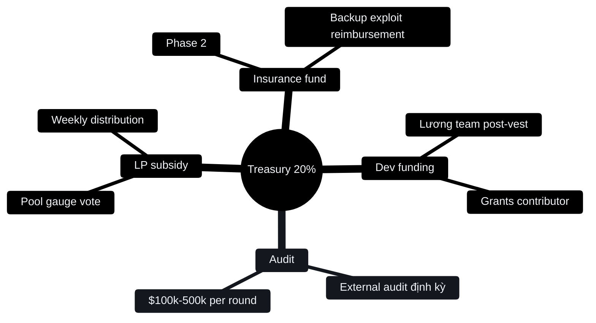

# Buyback-burn & treasury

30% phí protocol → mua PRX từ thị trường + burn vĩnh viễn. 20% → treasury fund growth.

## Cơ chế buyback-burn



1. Mỗi week, protocol collect phí từ AMM + CLOB + redemption + creation.
2. Smart contract tính `30% × weekly_fee_USDC`.
3. Gọi Router buy PRX trên thị trường bằng USDC đó.
4. PRX gửi tới `0x000...dEaD` (burn) — không ai unlock được.
5. Event `BuybackExecuted(usdcSpent, prxBurned)` emit on-chain.

Burn không reversible. Supply giảm vĩnh viễn.

## Phí flow



Mỗi $1 phí thu:

```
$0.50 → stkPRX staker  (USDC real yield)
$0.30 → buyback + burn  (giảm supply)
$0.20 → treasury        (dev, audit, LP gauge subsidy)
```

## Dự phóng buyback

| Year | Volume/tháng | Fee mix | Revenue/năm | 30% buyback/năm |
|---|---|---|---|---|
| Y1 | $50M | 0.5% | $3M | $900k |
| Y2 | $200M | 0.3% | $7.2M | $2.16M |
| Y3 | $1B | 0.2% | $24M | $7.2M |
| Y4 | $3B | 0.15% | $54M | $16.2M |

Tốc độ burn:
```
burn_per_year = buyback_USD / avg_PRX_price
```

Y3 với FDV $100M (giả sử) → $7.2M/năm = **7.2% supply burn/năm**.

## Net deflationary condition

PRX **net deflationary** khi:
```
burn_per_year > emission_per_year
```

Emission = community pool release + team vesting + treasury unlock. Sau năm 4, emission ≈ 0 (vest xong).

| Year | Emission (% supply) | Burn (% supply) | Net |
|---|---|---|---|
| **Y1** | 25% | 1% | +24% (dilutive) |
| **Y2** | 22% | 3% | +19% |
| **Y3** | 15% | 7% | +8% |
| **Y4** | 5% | 12% | −7% (deflationary) |
| **Y5+** | 1% | 15% | **−14% (strong deflationary)** |

- **Y1-Y4**: Emission dominant → circulating tăng (buyback giảm tốc độ).
- **Y4+**: Emission ≈ 0 → net deflationary nếu volume đủ (>$2-4M/tháng).

Y1-Y4 buyback giảm tốc độ dilution, không đảo chiều. Y5+ thực sự burn ròng.

## So với benchmarks

| Protocol | Buyback-burn % revenue | Deflationary? |
|---|---|---|
| Binance BNB | 20% (quarterly) | Yes (cap 100M) |
| GMX | 0% (100% → staker) | No (inflation esGMX) |
| Pendle | 0% | No |
| dYdX (v4) | ~0% | No (high emission) |
| **PrediX** | **30%** | **Yes post-Y4** |

PrediX kết hợp BNB (burn aggressive) + GMX (real yield):
- 50% staker yield (vs GMX 100%) — slightly less yield.
- 30% burn (vs BNB 20%) — supply pressure cao hơn.

Trade-off: ít yield short-term, supply long-term tốt hơn.

## Treasury — 20%

Treasury dùng cho 4 use case:



### Dev funding

- Team post-vest (sau 4 năm vesting xong): treasury support.
- Grants cho external contributor (open-source PR, audit report, integration).
- Hackathon prizes.

### Audit

- External audit firms (Spearbit, Trail of Bits, OpenZeppelin, Zellic).
- Frequency: ít nhất 1 round/year, thêm khi major upgrade.
- Budget: $100k-500k per round.

### LP subsidy qua gauge

- Pool nào được vePRX vote → treasury pay LP reward weekly.
- See [vePRX & gauge](veprx-gauge.md).

### Insurance fund (Phase 2)

- Top-up từ treasury + 5% staker yield.
- Coverage: partial reimbursement nếu contract exploit.
- Chỉ payout qua governance vote (không auto).

## Treasury management

- **On-chain multisig** 3/5 (Gnosis Safe).
- **Quarterly report** public on-chain — balance + spend log.
- **Spend > $10k**: Cần governance proposal + vePRX vote.
- **Spend < $10k**: Multisig discretion (operational).

## Track buyback + treasury

Public dashboard ([Dune](../tai-nguyen/links.md)):

- Weekly buyback amount + PRX burned.
- Cumulative burn since TGE.
- Treasury balance breakdown (USDC, PRX, others).
- Treasury spend history.

Event `BuybackExecuted` emit on-chain — bot có thể track realtime.

## Break-even protocol

Fixed cost ~$1M/năm (team post-vest + infra + audit). Protocol sustainable khi:

```
20% × fee_revenue ≥ $1M/năm fixed cost
50% × fee_revenue đủ giữ staker không unstake
30% × fee_revenue > 0 (sang net deflationary post-Y4)
```

Suy ra **fee_revenue ≥ $5M/năm = ~$417k/tháng**. Với fee mix 0.3%, cần **volume ~$140M/tháng**.

Thấp hơn đối thủ (Polymarket ~$500M-1B/tháng) → PrediX khả thi ở scale nhỏ hơn.

## Risk

| Risk | Mitigation |
|---|---|
| Volume không đạt | Treasury runway dài (4 năm vest), GTM thông minh, multi-chain |
| Buyback bị front-run | Random timing, chia tx nhỏ, dùng commit-reveal |
| Governance attack đổi 30% → 0% | vePRX supermajority cần > 66% vote |
| Treasury hack | Multisig 3/5 hardware wallet, audit Gnosis Safe |

## Tóm tắt

Buyback-burn = mechanic phổ biến, hoạt động tốt khi:
1. Volume thực tế đủ để buyback significant.
2. Emission đã vest gần hết.

PrediX áp dụng tỷ lệ cao (30% vs industry 10-20%) + floor break-even thấp ($140M vol/tháng) → tokenomics aligned, không phụ thuộc giá hype.

Không phải magic — cần volume thật. Nhưng cấu trúc đảm bảo: **user trade → protocol earn → token holder benefit**.
