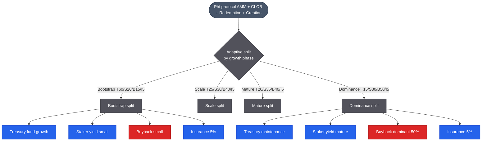
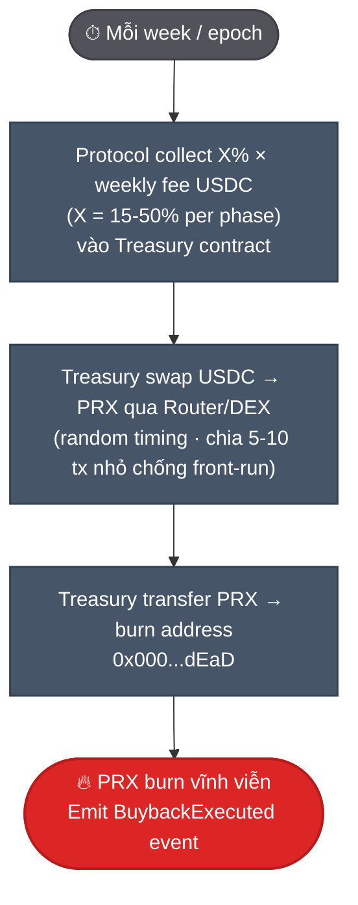
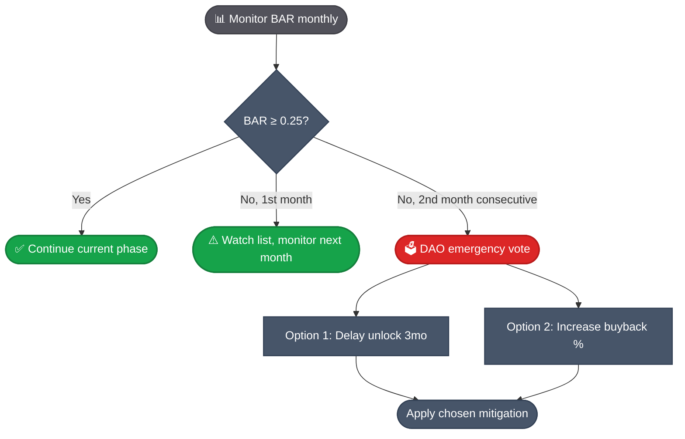
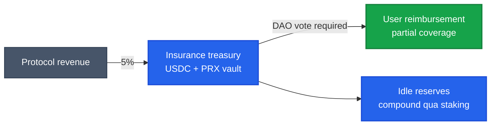
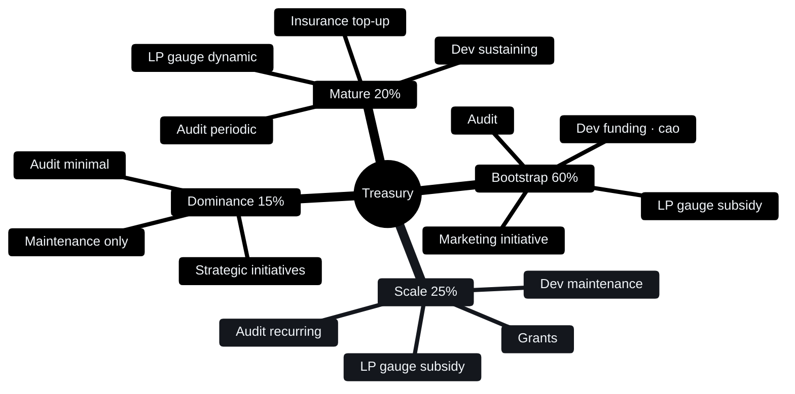

# Buyback-burn, treasury & insurance

PrediX dùng **adaptive 4-phase** fee distribution thay vì flat split. Buyback range **15% (bootstrap) → 50% (dominance)**. Insurance fund 5% mọi phase. Treasury vary 15-60%.

## Adaptive 4-phase split

| Phase | Trigger | Treasury | Staker | Buyback | Insurance |
|---|---|---|---|---|---|
| **Bootstrap** | M+7 → break-even (~M+13) | 60% | 20% | 15% | 5% |
| **Scale** | break-even → multi-chain | 25% | 30% | 40% | 5% |
| **Mature** | Y3+ multi-chain stable | 20% | 35% | 40% | 5% |
| **Dominance** | post-PMF, mature DAO | 15% | 30% | 50% | 5% |



**Tại sao adaptive**:
- Bootstrap phase: protocol cần runway → treasury 60% fund dev/audit. Buyback 15% chưa significant với volume nhỏ. Staker yield 20% giữ early staker.
- Scale phase: revenue đủ trả lương + dev → shift sang buyback (40%) tăng supply pressure, staker yield tăng (30%).
- Dominance phase: PMF clear → buyback dominant (50%), treasury minimal (15% maintenance).

Phase transition qua **DAO vote** dựa metric: volume, monthly burn, runway, BAR (bên dưới).

## Cơ chế buyback-burn



1. Mỗi week, protocol collect phí từ AMM + CLOB + redemption + creation.
2. Smart contract tính `phase_buyback_pct × weekly_fee_USDC`.
3. Gọi Router buy PRX trên thị trường bằng USDC đó (random timing, split tx).
4. PRX gửi tới `0x000...dEaD` (burn) — không ai unlock được.
5. Event `BuybackExecuted(usdcSpent, prxBurned, phase)` emit on-chain.

Burn không reversible. Supply giảm vĩnh viễn.

## BAR — Buyback Absorption Ratio

Governance gate ngăn unlock sell pressure vượt buyback absorption:

```
BAR = Monthly_Buyback_USD / (Monthly_Unlock_Tokens × PRX_Price)
```

**Target**: BAR ≥ 0.25.

**Trigger**: Nếu BAR < 0.25 trong **2 tháng liên tiếp** → DAO emergency vote 2 options:
1. **Delay unlock** — defer next vesting tranche 3 months.
2. **Increase buyback %** — bump phase up sớm hơn (vd Bootstrap 15% → Scale 40% early).



Source: PrediX Tokenomics v4 Production Spec. Prevents OPN-style unlock dump.

## Insurance fund — 5% all phases

5% protocol net revenue → **insurance treasury** trên mọi phase.

**Coverage**: Partial reimbursement nếu contract exploit. **Payout**: chỉ qua DAO vote (không auto).



Tham chiếu: Aave safety module, Bancor IL protection, Nexus Mutual.

## Phí throughput projection

| Phase | Volume/tháng | Fee mix | Revenue/năm | Buyback/năm | Staker yield/năm |
|---|---|---|---|---|---|
| **Bootstrap** | $20M | 0.32% | $768K | $115K (15%) | $154K (20%) |
| **Scale** | $100M | 0.30% | $3.6M | $1.44M (40%) | $1.08M (30%) |
| **Scale** | $500M | 0.25% | $15M | $6M (40%) | $4.5M (30%) |
| **Mature** | $1B | 0.22% | $26M | $10.4M (40%) | $9.1M (35%) |
| **Dominance** | $5B | 0.20% | $120M | $60M (50%) | $36M (30%) |

Tốc độ burn:
```
burn_per_year = buyback_USD / avg_PRX_price
```

Scale phase với FDV $100M (giả sử) → $6M/năm = **~6% supply burn/năm**.

## Net deflationary condition

PRX **net deflationary** khi:
```
burn_per_year > emission_per_year (vesting + season)
```

| Year | Phase | Emission (% supply) | Burn (% supply) | Net |
|---|---|---|---|---|
| **Y1** | Bootstrap → Scale | ~15-20% | ~1-2% | +13-19% (dilutive) |
| **Y2** | Scale | ~20% | ~3-5% | +15-17% |
| **Y3** | Scale → Mature | ~15% | ~6-8% | +7-9% |
| **Y4** | Mature | ~5% | ~8-10% | −3-5% (deflationary) |
| **Y5+** | Dominance | ~1% | ~10-15% | **−9-14% (strong deflationary)** |

- **Y1-Y3**: Emission dominant → circulating tăng (buyback giảm tốc độ + BAR gate prevent dump excess).
- **Y4+**: Emission near 0 → net deflationary nếu volume đủ (>$200M/tháng).

## So với benchmarks

| Protocol | Buyback % revenue | Mechanism | Deflationary? |
|---|---|---|---|
| **Hyperliquid (HYPE)** | ~97% | Continuous buyback + burn | Yes |
| **BNB** | 20% (quarterly) | Auto-burn from gas + buyback | Yes (cap 100M) |
| **GMX** | 0% | 100% → staker | No (esGMX inflation) |
| **Pendle** | 0% | Lock-vote yield | No |
| **dYdX (v4)** | ~0% | High emission | No |
| **PrediX** | **15-50% adaptive** | **Phase-based, BAR gate** | **Yes post-Y4** |

PrediX kết hợp:
- **Adaptive (vs Hyperliquid flat 97%)**: Bootstrap phase prefer treasury for runway. Mature shift to buyback dominant. Less aggressive than Hyperliquid (97%) but more sophisticated than BNB (20% flat).
- **BAR gate**: Unique mechanism — không protocol nào có. Prevents unlock dump.
- **Insurance fund 5%**: Tham chiếu Aave safety module — bảo vệ user, không có ở GMX/Pendle.

## Treasury — adaptive 15-60%

Treasury allocate fund cho 5 use case (priority order phase-dependent):



### Dev funding
- Lương team post-vest (sau 4 năm vest xong)
- Grants cho external contributor (open-source PR, integration, audit)
- Hackathon prizes

### Audit
- External firms: Spearbit, Trail of Bits, OpenZeppelin, Zellic
- Frequency: ≥ 1 round/year + thêm khi major upgrade
- Budget: $100k-500k per round

### LP subsidy (gauge voting)
- Pool nào được vePRX vote → treasury pay LP reward weekly
- See [vePRX & gauge](veprx-gauge.md)

### Marketing initiative
- Bootstrap: KOL onboarding, exchange listing, FIFA campaign
- Mature: brand maintenance, ecosystem partnership

### Insurance top-up
- Bootstrap: 5% fee → insurance, treasury top-up nếu cần
- Mature: insurance fully self-sustaining, treasury minimal

## Treasury management

- **On-chain multisig** 3/5 (Gnosis Safe).
- **Quarterly report** public on-chain — balance + spend log.
- **Spend > $10k**: Cần governance proposal + vePRX vote.
- **Spend < $10k**: Multisig discretion (operational).

## Track buyback + treasury + insurance

Public dashboard ([Dune](../tai-nguyen/links.md)):

- Weekly buyback amount + PRX burned (theo phase).
- Cumulative burn since TGE.
- BAR ratio monthly.
- Treasury balance breakdown (USDC, PRX, others).
- Insurance fund balance + payout history.
- Treasury spend history.

Events realtime: `BuybackExecuted`, `InsuranceTopUp`, `InsurancePayout`, `PhaseTransition`.

## Break-even protocol

Fixed cost ~$56k/tháng burn rate (team + infra + audit reserve). Y1 total burn ~$1.025M (incl $292K legal).

Break-even:
```
Phase_buyback_pct × fee_revenue ≥ Treasury_share_pct × $56k/mo
```

Bootstrap phase 60% treasury share → revenue ≥ $93k/tháng → volume ≥ **$17.3M/tháng** với fee 0.324% net (after maker rebate + affiliate).

Tham chiếu market context (March 2026, source: DeFi Rate):
- Polymarket volume: $10.57B/tháng
- Kalshi volume: $13.07B/tháng
- Total PM volume: $23.6B/tháng
- **PrediX market share to break-even: 0.073%**

Thấp hơn đối thủ rất nhiều → khả thi ở scale nhỏ.

**Break-even month**: M+13 (post-mainnet).
**Cash low point**: $1.241M @ M12 (62% of $2M raise remaining — comfortable runway).

## Founder liquidity (overlap với buyback)

Founder may sell max **15%/quarter** of vested tokens via Treasury buyback program (TWAP 7-day). Treasury absorbs PRX, founder nhận USDC. Treasury hold PRX (effectively reduce circulating).

Detail: [Allocation & vesting](allocation-vesting.md#founder-liquidity-window).

## Risk

| Risk | Mitigation |
|---|---|
| Volume không đạt break-even | Bootstrap T60% runway dài (4 năm vest) + Adaptive shift sớm nếu BAR low |
| Buyback bị front-run | Random timing, chia tx nhỏ, dùng commit-reveal |
| Unlock dump cao hơn buyback | **BAR ≥ 0.25 governance gate** (2-month consecutive trigger) |
| Phase transition quá sớm/muộn | DAO vote dựa metric công khai (revenue, runway, BAR) |
| Insurance fund insufficient cho exploit | DAO vote payout %, partial reimbursement, không full |
| Treasury hack | Multisig 3/5 hardware wallet, audit Gnosis Safe periodically |
| Governance attack đổi % | vePRX supermajority cần > 66% vote |

## Tóm tắt

Adaptive buyback-burn aligned với protocol growth phase, không one-size-fits-all:

1. **Bootstrap**: prioritize treasury runway + insurance.
2. **Scale**: shift to buyback (40%) + staker yield (30%).
3. **Mature/Dominance**: buyback dominant (50%), treasury minimal.

**BAR gate** + **insurance fund** là 2 cơ chế unique giảm tail risk:
- BAR prevents unlock-driven dump.
- Insurance reimburses user nếu exploit.

User trade → protocol earn → buyback absorb supply → token holder benefit. Adaptive ensures sustainable across phases.
