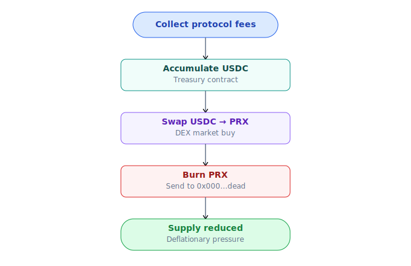

# Buyback-burn & treasury

PrediX mua PRX từ thị trường bằng phí protocol + burn vĩnh viễn.

## Cơ chế

Event `BuybackExecuted(usdcSpent, prxBurned)` emit on-chain. Burn không reversible.

## Net deflationary

PRX trở nên **net deflationary** khi burn/năm > emission/năm. Emission ≈ 0 sau 4 năm vest xong → post-Y4 net deflationary nếu volume duy trì.

## Insurance fund

Một phần protocol revenue → insurance treasury. Coverage: partial reimbursement nếu contract exploit. Payout chỉ qua DAO vote, không auto.

## Treasury

Treasury fund 4 use case:

| Use case | Detail |
|---|---|
| **Dev funding** | Team post-vest, grants contributor, hackathon |
| **Audit** | External audit firms, ≥ 1 round/year |
| **LP subsidy** | Gauge voting — pool được vePRX vote nhận subsidy |
| **Insurance top-up** | Bổ sung insurance fund khi cần |

Quản lý:
- On-chain multisig 3/5 (Gnosis Safe)
- Spend > $10k → governance vote
- Quarterly report public

## Track

Public dashboard:
- Weekly buyback amount + PRX burned
- Cumulative burn since TGE
- Treasury balance + spend history
- Insurance fund balance
