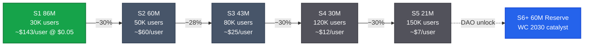
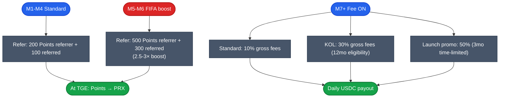
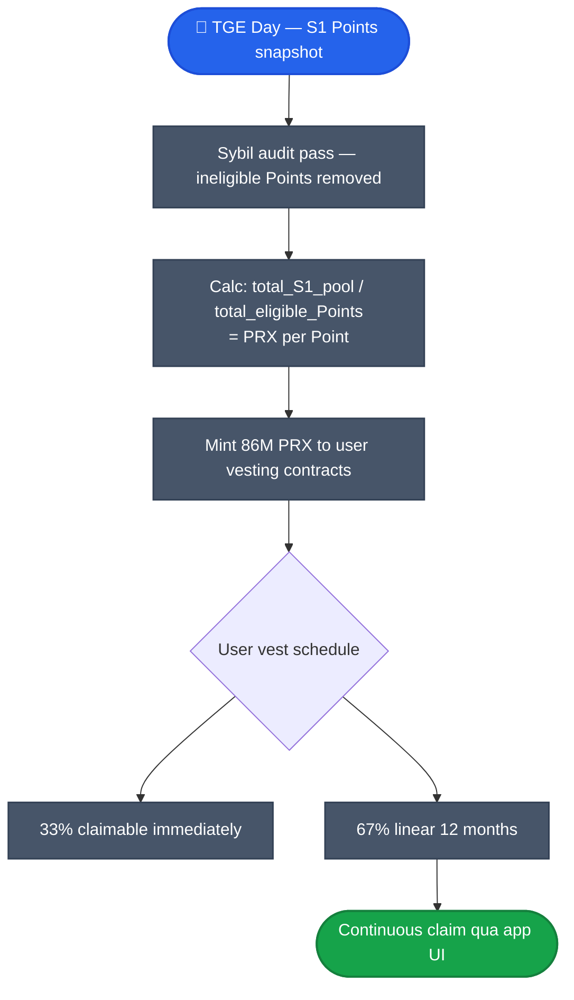

# Points & seasons

PrediX dùng **6-season Points emission** thay vì airdrop one-time. Tổng community pool = **300M PRX (30% supply)** trải 3 năm. Catalyst-driven (FIFA WC 2026 cho S1, WC 2030 cho S6 reserve). Tham chiếu: Blur, Hyperliquid, EigenLayer.

## 6-Season overview — 300M PRX qua 3 năm

| Season | Pool | % của 300M | Timeline | Theme / Catalyst | Earn method | Conversion |
|---|---|---|---|---|---|---|
| **S1 Genesis** | 86M | 28.7% | M1-M6 | Mainnet + FIFA World Cup 2026 | Sign up · trade · refer · LP · FIFA quests · oracle vote | Points → PRX at TGE |
| **S2 Growth** | 60M | 20.0% | M7-M12 | Fee ON + TGE + listing | Volume milestones · vePRX staking · governance | Claim via staking |
| **S3 Scale** | 43M | 14.3% | M13-M18 | Multi-chain + new categories | Cross-chain LP · market creation · oracle | vePRX boost |
| **S4 Mature** | 30M | 10.0% | M19-M24 | Institutional API + derivatives | API integration · institutional ref · DAO | Governance-voted |
| **S5 Expand** | 21M | 7.0% | Y3 H1 | Regional expansion events | Geo-specific campaigns · new sports | DAO-governed |
| **S6+ Reserve** | 60M | 20.0% | Y3+ | Emergency · partnerships · WC 2030 | DAO vote required to unlock | vePRX governance |
| **Total** | **300M** | **100%** | **3 years** | | | |

## Why declining 30%/season



**S1 largest (86M)** vì cold-start = hardest. Early users earn ~20× hơn late joiners.
- S1 = ~2,867 PRX/user ($143 @ $0.05) — strongest FOMO khi platform empty.
- S5 = ~133 PRX/user ($7) — lower per-user nhưng platform có liquidity + network effect.

**S6 Reserve (60M = 20%)** locked trong DAO. Chỉ unlock qua **vePRX governance vote** — emergency, partnership, hoặc WC 2030 catalyst.

**Self-sustaining từ S3+**: revenue buyback recycle ~25-35M PRX/season → DAO redirect to refill Season pool nếu cần.

Tham chiếu industry:
- **Blur Season 1** airdrop 3× larger than Season 2
- **Hyperliquid** front-loaded 31% HYPE for Genesis
- **EigenLayer** Season 1 largest, decay subsequent

## S1 Genesis (M1-M6) — Points system

Free period (M1-M6) — không phí, mọi action earn Points. Convert Points → PRX **at TGE** theo formula:

```
Your PRX = (Your Points ÷ Total S1 Points) × 86M PRX
```

**S2-S6 pools separate** — unspent S1 KHÔNG carry over.

### S1 activities + Points

| Activity | Points | Gas equivalent | Purpose |
|---|---|---|---|
| Sign up + KYC-lite | 100 | 500 transactions | Onboarding |
| First trade | 50 | 250 transactions | Activation |
| Per $100 volume | 10 | 50 transactions | Volume incentive |
| Refer friend (friend trades ≥1×) | 200 | 1,000 transactions | Viral growth |
| Provide liquidity ≥$100 | 150 | 750 transactions | TVL building |
| Oracle vote | 50 | 250 transactions | Decentralization |
| 7-day streak | 30 | 150 transactions | Retention |

### Cost to protocol (S1)

| Scenario | Users | Gas airdrop | Total cost |
|---|---|---|---|
| Bear | 10K | $1,000 | $1,500 |
| Base | 30K | $3,000 | $5,000 |
| Bull | 50K | $5,000 | $10,000 |

Gas $0.0002/tx Unichain L2 → cost negligible.

## 2-Phase referral program

**Phase 1 (M1-M6 — free period)**: Points referral. Reward = Points convertible to PRX at TGE. **8-33× more valuable** than fee commission (token upside vs cash).

**Phase 2 (M7+ — fee ON)**: Fee commission. Daily USDC settlement.



### Phase 1 detail (M1-M6)

| Action | Referrer | Referred | Mechanic |
|---|---|---|---|
| Refer (standard M1-M4) | 200 Points | 100 Points | Base referral |
| Refer during FIFA (M5-M6) | 500 Points (2.5×) | 300 Points (3×) | Double-boost = max sharing |
| Ref makes first trade | +50 bonus Points | +50 Points | Activation |
| Ref trades $500+ FIFA | +200 Points | +100 Points | Volume incentive peak |
| Ref refers someone (indirect) | +100 Points | — | 2nd-degree spread |
| **Total per active FIFA ref** | **~850 Points** | **~450 Points** | |

Ongoing: referrer earns **10% of referred user's Points** (compound).

### Phase 2 detail (M7+)

| Tier | Commission | Duration | Eligibility |
|---|---|---|---|
| **Standard user** | 10% gross fees | Permanent | Any user with ≥500 volume |
| **KOL / Partner** | 30% gross fees | 12 months | Verified KOL ≥5K followers |
| **Launch promo (FIFA)** | 50% gross fees | 3 months only (M5-M7) | Time-limited promotional |

### KOL income projection (Phase 2)

| KOL drives volume/mo | 10% commission | 30% commission | Context |
|---|---|---|---|
| $200K (50 refs, small KOL) | $94/mo | $282/mo | Side income |
| $1M (200 refs, mid KOL) | $470/mo | $1,410/mo | Meaningful APAC income |
| $5M (1K refs, large KOL) | $2,350/mo | $7,050/mo | Full-time promote worthy |
| $20M (5K refs, top KOL) | $9,400/mo | $28,200/mo | Life-changing for APAC KOL |

### Phase 1 → Phase 2 transition (M6 → M7)

| Element | Phase 1 (free) | Transition | Phase 2 (fee ON) |
|---|---|---|---|
| Referral link | Same link | No change | Same link |
| Old refs | Earn Points | Auto-migrate | Earn fee commission từ ALL old refs |
| Points accumulated | Growing | Snapshot | Convert to PRX at TGE |
| KOL income | $0 cash (Points) | First USDC payout | Daily USDC settlement |
| Double reward | — | — | **PRX (Points) + USDC (fees) on same refs** |

**Smart**: M7-M8 user earn cả PRX (S1 Points convert) **và** USDC (Phase 2 commission từ same refs).

## KOL earning — Points vs Fee commission (1K refs comparison)

| Metric | Points (Phase 1) | Fee 30% (hypothetical) | Winner |
|---|---|---|---|
| KOL earns 6 months | ~500K Points → 1.5M PRX | $9,000 USDC | Points (8-33×) |
| Value at TGE ($0.05) | $75,000 | $9,000 | Points |
| Value at $0.20 | $300,000 | $9,000 | Points |
| Upside potential | Unlimited (token price) | Fixed (fee %) | Points |
| Precedent | Blur, Hyperliquid, EigenLayer | Binance, Bybit | Both proven |

→ **Phase 1 Points >> Phase 2 Fee** cho KOL muốn maximum upside. Cơ chế thiết kế để **front-load KOL acquisition** trong free period.

## Industry benchmark (April 2026)

| Protocol | Referrer earns | User gets | Source |
|---|---|---|---|
| Hyperliquid | 10% taker fees | 4% fee discount | Hyperliquid Docs |
| Polymarket (promo) | 30% fees (direct) | — | PM Help Center 3/2026 |
| Polymarket (indirect) | 10% fees (2nd tier) | — | PM Docs |
| Binance | 20-40% fees | 5-20% kickback | Binance Referral |
| **PrediX** | **10% user / 30% KOL / 50% promo** | **Points → PRX (Phase 1)** | Tiered model |

## S2-S6 emission (post-TGE)

S2-S6 pool unlock theo schedule:
- **S2 (M7-M12)**: 60M PRX. Fee ON. Volume milestones + vePRX staking + governance proposals.
- **S3 (M13-M18)**: 43M PRX. Multi-chain. Cross-chain LP + market creation + oracle vote.
- **S4 (M19-M24)**: 30M PRX. Institutional API + DAO mature.
- **S5 (Y3 H1)**: 21M PRX. Geo expansion + new sport categories.
- **S6+ (Y3+)**: 60M PRX **DAO-locked**. Unlock requires vePRX vote — Emergency, partnerships, hoặc WC 2030 catalyst.

Conversion mechanism varies per season:
- S1: Points → PRX at TGE (one-time conversion)
- S2: Claim via staking (continuous, vePRX-gated)
- S3+: vePRX boost multiplier (require lock)
- S4+: Governance-voted distribution

Self-sustaining từ S3: revenue buyback recycle ~25-35M PRX/season → có thể refill Season pool qua DAO vote.

## Anti-gaming

| Mechanism | Detail |
|---|---|
| Sybil detection | Address clustering, gas pattern, behavioral analysis |
| Volume-weighted | Wash trade auto-decay (mua + bán ngay → Points giảm hoặc 0) |
| Cap per wallet | Tier reward absolute cap (e.g. max 10K Points/day) |
| Min stake post-TGE | Tài khoản cần stake ≥ 10 PRX để earn reward >$X |
| Verification | Email + (optional) phone — un-verified slow rate |
| Snapshot timing | Random snapshot moments để avoid game last-minute |

## TGE conversion ceremony



Vest schedule prevent dump:
- 33% immediate liquidity (lock 0)
- 67% linear 12 months — earn yield qua [staking](staking-real-yield.md) trong khi vest

## Track Points + season

App UI: **Profile → Points** tab.

Per-season dashboard ([Dune](../tai-nguyen/links.md)):
- Total Points earned (your wallet)
- Rank trong season
- Estimated PRX (current pool / total Points)
- Next milestone unlock

## API

```
GET /api/v2/points/:address                      # current Points + season
GET /api/v2/points/:address/history              # earn history
GET /api/v2/points/seasons                        # all seasons + status
GET /api/v2/points/seasons/:id/leaderboard       # top earners
GET /api/v2/points/conversion-estimate            # estimate PRX at current pool
GET /api/v2/referrals/:address                    # refer tree + earnings
```

Chi tiết: [API reference](../developers/api-reference.md#backend-endpoints-v2).

## Tóm tắt

- **300M PRX (30% supply)** chia 6 seasons trên 3 năm.
- **S1 Genesis (86M)** lớn nhất, FIFA WC 2026 catalyst, Points → PRX at TGE.
- **2-Phase referral**: Points (M1-M6) → Fee commission (M7+). Phase 1 8-33× value cho KOL.
- **S6 Reserve (60M)** DAO-locked — only WC 2030 hoặc emergency unlock.
- **Self-sustaining từ S3+**: revenue buyback recycle PRX, refill pool qua DAO vote.
- **Anti-gaming**: Sybil detection + cap + min stake post-TGE.

Tham chiếu: Blur S1>S2 3×, Hyperliquid Genesis 31%, EigenLayer S1 largest. PrediX dùng combined pattern + WC catalyst unique.
