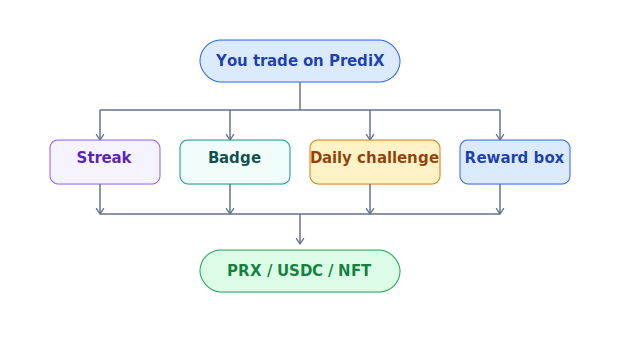
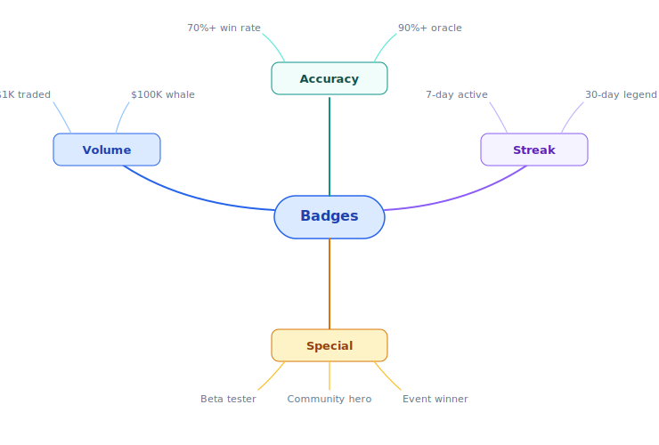
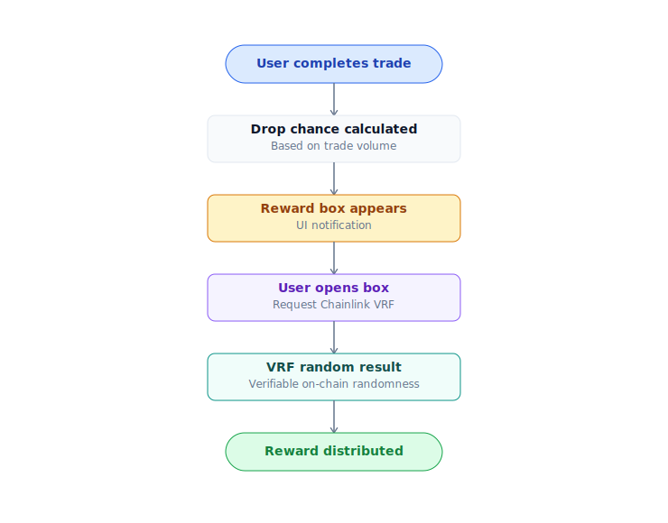

# Rewards & gamification

Activity rewards lâu dài (badge, streak, daily challenge, reward box). Không phụ thuộc Season pool — engagement-driven, suốt vòng đời protocol.

> Points / season-based emission / referral 2-phase: xem [Points & seasons](points-seasons.md).



## 1. Streak — chuỗi hành động

| Streak type | Tiêu chí | Reward |
|---|---|---|
| **Daily login** | Login mỗi ngày liên tiếp | 5 / 10 / 25 / 50 Points @ 7 / 30 / 100 / 365 days |
| **Win streak** | Trade thắng liên tiếp (>$10) | Multiplier 1.1× → 2.0× points cho trade tiếp theo |
| **Trading streak** | Trade ≥ 1 mỗi ngày | Daily bonus + badge |

Mất streak nếu skip day. Restart từ 0.

## 2. Badges — NFT milestone

NFT badge (ERC-1155 trên Unichain) earn khi đạt milestone:



- Badges là NFT — transferrable (đến khi locked).
- Hiển thị trên profile, leaderboard.
- Một số badge **lock** (không transfer được) để tránh wash.
- Badge rare có thể collateral cho lending Phase 2.

## 3. Daily challenges

Mỗi ngày có 3 challenges random:

| Ví dụ challenge | Reward |
|---|---|
| Trade volume ≥ $50 hôm nay | 100 Points |
| Place 1 limit order | 50 Points |
| Hold position ít nhất 4 giờ | 75 Points |
| Try 3 markets khác nhau | 100 Points |
| Refer 1 bạn | xem [Points & seasons](points-seasons.md#2-phase-referral-program) |

Reset 00:00 UTC mỗi ngày.

## 4. Reward boxes — random drop

Sealed box mở lúc resolve, content random PRX / USDC / NFT.



- **Drop rate**: ~5% mỗi trade > $10.
- **Pool**: 80% PRX, 15% USDC, 5% rare NFT.
- **Range**: 1-1000 PRX (median ~10), $0.10-$50 USDC (median $1), NFT special edition.
- **Randomness**: Chainlink VRF — verifiable, không manipulate được.

## Convert points → PRX

**S1 (M1-M6, free period)**: Points convert at TGE. See [Points & seasons §S1 Genesis](points-seasons.md#s1-genesis-m1-m6--points-system).

**Post-TGE**: Points từ activity rewards (streak, daily challenge) convert weekly:

```
Your weekly PRX = (your weekly points / total weekly points) × weekly PRX pool
```

Weekly pool funded từ Season pool (S2-S6 active) hoặc Treasury budget (governance vote).

Claim manual hoặc auto-compound (re-stake vào vault).

## Anti-sybil

Để reward không bị bot farm:

- **Min stake post-TGE**: Tài khoản cần stake ≥ 10 PRX để earn reward >$X.
- **Verification**: Email + (optional) phone giảm rate cho un-verified.
- **Behavior pattern**: Wash trade detector — mua + bán ngay nhiều lần, points trade volume giảm hoặc 0.
- **Cap per wallet**: Tier reward có cap absolute (vd max 10,000 pt / day).
- **Snapshot random**: Đôi khi snapshot lúc khác giờ thường để avoid game last-minute.

## Roadmap (TBA)

- Tournament mode (weekly competition, prize pool)
- Quest line theo theme (crypto, sports, politics)
- Guild system (group reward)

