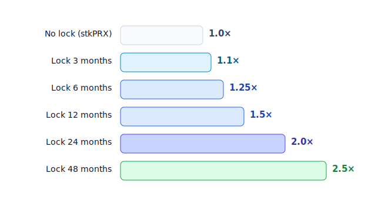

# Staking real yield

Lock PRX → nhận share phí protocol dạng **USDC thật**. Không emission.

## Cơ chế


1. Deposit N PRX vào `StakingVault`.
2. Vault mint N **stkPRX** (non-transferable) cho bạn — claim share fee.
3. Mỗi week (epoch), protocol collect share phí USDC → distribute vault pro-rata.
4. Claim USDC bất cứ lúc nào, hoặc auto-compound (convert PRX rồi re-stake).
5. Unstake: cooldown 7 ngày (chống front-run khi event lớn).

## Tính yield

```
your_yield = staker_share × (your_stake / total_staked)
APY_USDC   = (weekly_yield × 52) / your_stake_USD_value
```

Yield float theo volume thật. Volume tăng → yield tăng. Volume giảm → yield giảm.

## Lock boost

Lock PRX để nhận **boost yield + governance weight**:



| Lock | Yield boost | vePRX weight |
|---|---|---|
| No lock (stkPRX) | 1.0× | 0 |
| 3 tháng | 1.1× | 0.25× |
| 6 tháng | 1.25× | 0.5× |
| 12 tháng | 1.5× | 1.0× |
| 24 tháng | 2.0× | 2.0× |
| 48 tháng (max) | 2.5× | 4.0× |

Lock càng lâu = yield USDC + governance power càng cao.

Chi tiết governance: [vePRX & gauge](veprx-gauge.md).

## Rủi ro staker

| Risk | Mitigation |
|---|---|
| **Volume giảm** → yield giảm | Diversify nhiều income stream (LP, content) |
| **PRX price giảm** → USD value yield giảm | Stake để long-term, không trade short-term |
| **Smart contract risk** | Vault audit cùng core protocol. Bug bounty active |
| **Slashing** | Vault staking **không** bị slash (chỉ oracle dispute bond Phase 2 mới có slash) |

## Unstake flow


