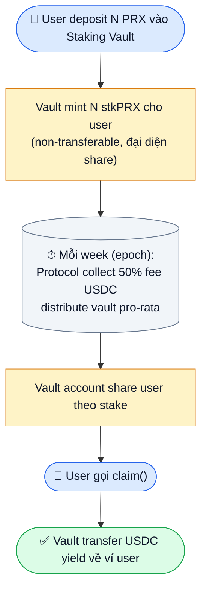
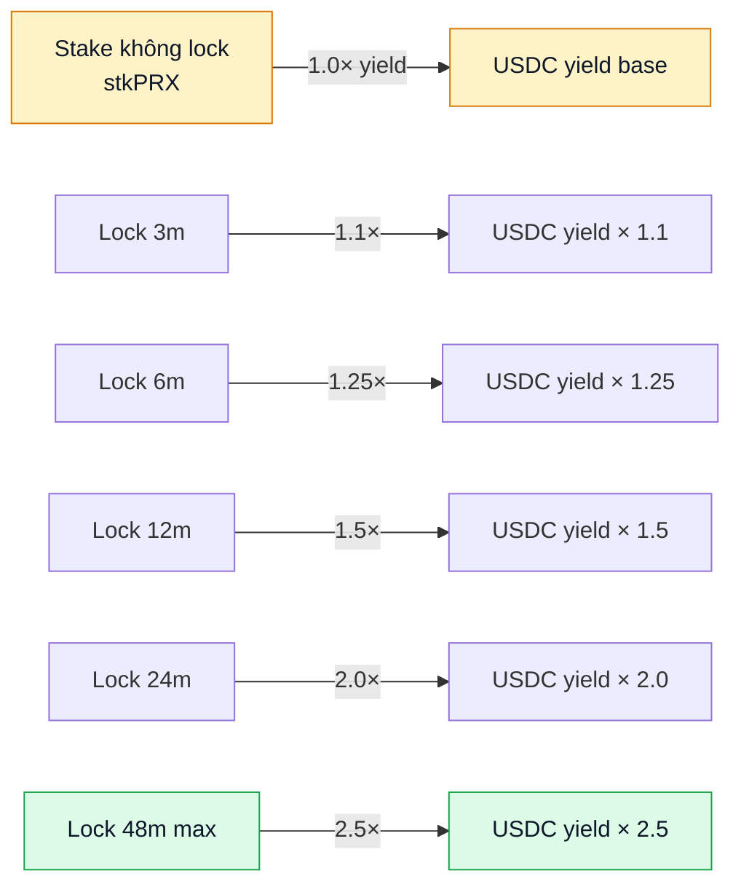
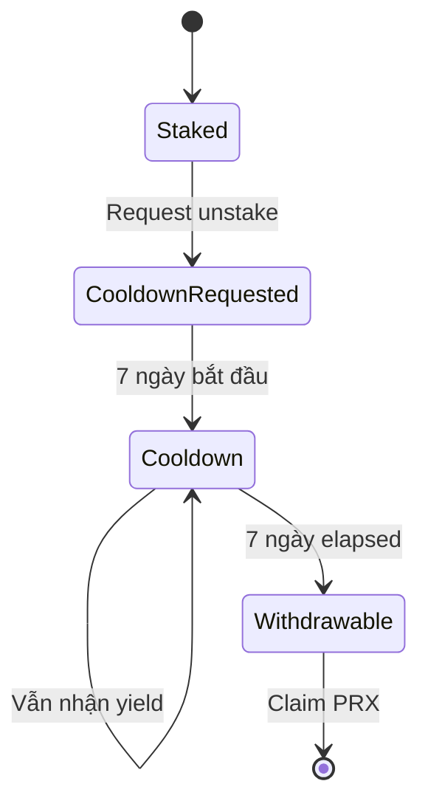

# Staking real yield

Lock PRX → nhận share **50% phí protocol** dạng **USDC thật**. Không emission.

## Cơ chế



1. Deposit N PRX vào `StakingVault`.
2. Vault mint N **stkPRX** (non-transferable) cho bạn — claim share fee.
3. Mỗi week (epoch), protocol collect 50% fee USDC từ AMM + CLOB + redemption + creation → distribute vault pro-rata.
4. Claim USDC bất cứ lúc nào, hoặc auto-compound (convert PRX rồi re-stake).
5. Unstake: cooldown 7 ngày (chống front-run khi event lớn).

## Tính yield

```
staker_share = 50% × total_fees_USDC_weekly
your_yield   = staker_share × (your_stake / total_staked)
APY_USDC     = (weekly_yield × 52) / your_stake_USD_value
```

### Ví dụ steady state

- Protocol volume: $200M/tháng
- Fee mix: 0.3% → revenue $600k/tháng
- Staker portion: $300k/tháng = $3.6M/năm USDC
- Total stake: 100M PRX @ $0.05 = $5M market cap staked
- **APY_USDC = 3.6M / 5M = 72%**

Yield float theo volume thật. Volume tăng → yield tăng. Volume giảm → yield giảm.

## So với staking model khác

| Protocol | Yield source | Sustainability |
|---|---|---|
| **Lido stETH** | ETH staking yield (~3%) | Cao |
| **Aave stkAAVE** | Emission stkAAVE + safety module | Trung bình (inflationary) |
| **GMX esGMX** | Fee USDC + ETH từ volume | Cao (real yield) |
| **PrediX stkPRX** | **Fee USDC từ volume protocol** | **Cao (real yield, GMX model)** |

PrediX chọn GMX model:
- Không dilute supply PRX.
- Yield gắn với business performance, không ép emission.
- User đo được: volume lên → yield lên.

## Lock boost

Lock PRX để nhận **boost yield + governance weight**:



| Lock | Yield boost | vePRX weight |
|---|---|---|
| No lock (stkPRX) | 1.0× | 0 |
| 3 tháng | 1.1× | 0.25× |
| 6 tháng | 1.25× | 0.5× |
| 12 tháng | 1.5× | 1.0× |
| 24 tháng | 2.0× | 2.0× |
| 48 tháng (max) | 2.5× | 4.0× |

Boost từ treasury (20% phí). Lock càng lâu = yield USDC + governance power càng cao.

Chi tiết governance: [vePRX & gauge](veprx-gauge.md).

## Fee discount cho staker

Stake ≥ ngưỡng → giảm fee giao dịch:

| Stake threshold | CLOB taker discount | AMM discount |
|---|---|---|
| 1,000 PRX | 10% | 0% |
| 10,000 PRX | 25% | 10% |
| 100,000 PRX | 50% | 25% |
| 1,000,000 PRX | 50% (cap) | 50% (cap) |

Discount active ngay khi stake, apply tự động trong mỗi tx.

## Rủi ro staker

| Risk | Mitigation |
|---|---|
| **Volume giảm** → yield giảm | Diversify nhiều income stream (LP, content) |
| **PRX price giảm** → USD value yield giảm | Stake để long-term, không trade short-term |
| **Smart contract risk** | Vault audit cùng core protocol. Bug bounty active |
| **Slashing** | Vault staking **không** bị slash (chỉ oracle dispute bond Phase 2 mới có slash) |

## Unstake flow



1. UI: **Request unstake**.
2. Cooldown 7 ngày bắt đầu. Trong cooldown:
   - Vẫn nhận yield (không rug bạn giữa chừng).
   - Không rút được PRX.
   - Không cancel được (tránh flip-flop).
3. Sau 7 ngày: **Claim** → PRX về ví.

Cooldown tránh user unstake trước event lớn rồi restake ngay sau (giảm tính ổn định yield pool).

## Auto-compound

Nếu enable auto-compound:
- Mỗi epoch yield USDC tự động:
  1. Buy PRX trên thị trường (qua Router).
  2. Re-stake vào vault.
- Compound interest effect.

Off mặc định — bạn opt-in trong vault settings.

## Khi nào staking khởi động

- Launch cùng TGE (TBA).
- Có thể có period **pre-stake** 1-2 tuần cho whitelist (pre-seed, seed, team) để bootstrap.
- Staking contract deploy + audit song song core, expect cùng mainnet.

## Insurance fund (Phase 2)

Dự kiến: 5% staker yield → insurance fund treasury. Mục đích: backup nếu protocol bị exploit, partial reimbursement cho user affected. Detail TBA.

## API

```
GET  /api/v2/staking/stats           # total staked, APR, your share
GET  /api/v2/staking/:address        # your stake, unclaimed yield
POST /api/v2/staking/:address/claim  # trigger claim (returns calldata)
GET  /api/v2/staking/history         # epoch distribution history
```

Chi tiết: [Backend API](../developers/backend-api.md).
