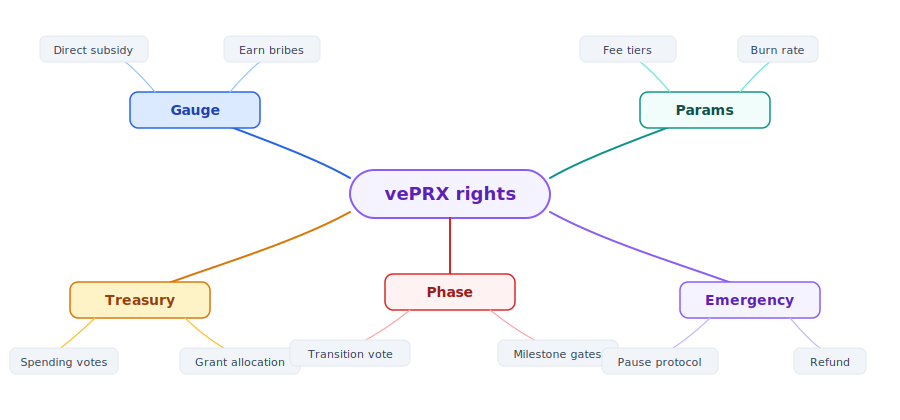
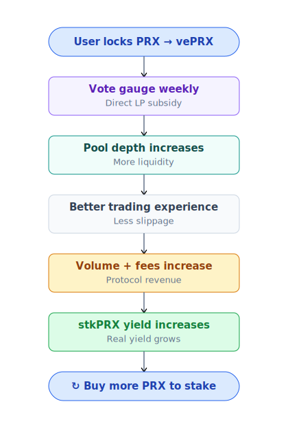
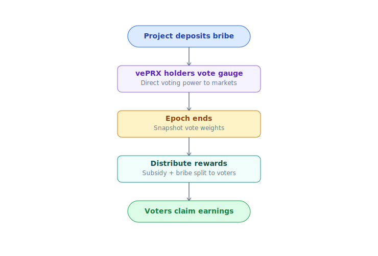

# vePRX & gauge voting

Lock PRX → vePRX (vote-escrowed) → vote gauge + boost yield + governance.

## vePRX là gì

**vePRX** = "vote-escrowed PRX". Lock PRX, nhận vePRX (non-transferable) biểu diễn governance weight.

- **Không nhận thêm token** — chỉ ghi nhận quyền.
- **Weight giảm tuyến tính** theo thời gian — gần hết lock thì weight thấp.
- **Hết lock**: vePRX = 0, PRX unlock rút được.

## Công thức weight

```
vePRX_weight = PRX_locked × (remaining_lock_time / max_lock_time)
max_lock_time = 4 năm (48 tháng)
```

Ví dụ:

| Lock amount | Lock duration | vePRX initial |
|---|---|---|
| 1000 PRX | 4 năm (max) | 1000 |
| 1000 PRX | 2 năm | 500 |
| 1000 PRX | 1 năm | 250 |
| 1000 PRX | 6 tháng | 125 |

Sau 6 tháng pass (lock 4-năm còn 3.5 năm) → weight giảm từ 1000 → 875 vePRX.

Decay tuyến tính theo block. Không step.

## Quyền vePRX



## Gauge voting — flywheel

Mỗi market có **gauge**. vePRX holder vote gauge nào nhận LP subsidy từ treasury.



Gauge = pool YES-USDC (hoặc NO-USDC) của market cụ thể. Pool nào được vote nhiều → LP earn nhiều hơn.

## Ai vote gì

- **LP đang cung cấp liquidity** → vote pool họ LP để nhận subsidy nhiều hơn.
- **Project owner tạo market** → vote market của mình để attract LP + trader.
- **Trader quan tâm market** → vote market đó để depth sâu hơn.

## Bribe market



External project trả PRX/USDC cho vePRX holder vote pool của họ — tạo thị trường vote liquid.

PrediX self-host bribe layer (Phase 2).

## Boost USDC yield

vePRX holder cũng là stkPRX holder → nhận boost yield USDC:

| Lock | Yield boost | vote weight |
|---|---|---|
| No lock | 1.0× | 0 |
| 4 năm lock | 2.5× | 4× |

Lock lâu = yield + voting power cao. Đi cùng nhau.

Chi tiết: [Staking real yield](staking-real-yield.md).

## Restrictions

- **vePRX không transfer** được. Buy PRX → lock → có vePRX.
- **Extend lock**: 1-năm còn 3 tháng, extend thêm 9 tháng → 1 năm mới (reset clock).
- **Early unlock**: Phase 2 cho phép unlock sớm với **50% PRX penalty** đi vào treasury. Hiện tại: hard lock.

## Quyền protocol params

vePRX vote thay đổi:

| Param | Default | Range |
|---|---|---|
| Oracle approve list | … | Add/remove adapter |
| Market creation bond | TBA | 1k-100k PRX |
| Stake unstake cooldown | 7 ngày | 1-30 ngày |
| Buyback frequency | Weekly | Daily-Monthly |
| **Phase transition** | Bootstrap @ TGE | Bootstrap → Scale → Mature → Dominance |
| **Revenue split** | Per-phase preset | DAO-adjustable |

### Phase transition + S6 Reserve

vePRX vote phase upgrade (Bootstrap → Scale → Mature → Dominance) dựa metric công khai (volume, runway). S6 Reserve (60M PRX) DAO-locked — unlock qua vePRX vote.

Proposal flow:
1. vePRX holder propose change (cần > 100k vePRX để propose, anti-spam).
2. 7-day discussion window trên forum.
3. 5-day voting period (Snapshot off-chain hoặc on-chain).
4. Quorum: > 4% total vePRX vote.
5. Pass: > 50% YES of votes.
6. Execute: Timelock 48h + multisig execute.

## Treasury spend governance

vePRX vote chi tiêu treasury:

- Audit funding (e.g. $200k for Spearbit).
- Grant cho dev / contributor ($5k-100k typical).
- Marketing initiative.
- Insurance fund top-up.

Tương tự process proposal.

## Quadratic voting (TBA)

Phase 2 sẽ experiment quadratic voting cho proposal lớn:
```
voting_power = sqrt(vePRX_weight)
```

Giảm whale dominance. Chỉ apply cho proposal > $100k spend.

## Risks

| Risk | Mitigation |
|---|---|
| **Vote concentration** (whale lock lớn) | Quadratic voting Phase 2 |
| **Bribe corruption** (voter chọn theo bribe, không merit) | Trade-off chấp nhận — bribe tạo market demand cho vePRX |
| **Low participation** (ít ai vote) | Default fallback (đều các pool) + small PRX emission cho voter |

## Timeline rollout

| Phase | Feature |
|---|---|
| **TGE** | Lock PRX → vePRX. Gauge vote basic. |
| **TGE + 3m** | Yield boost tier kích hoạt. |
| **TGE + 6m** | Bribe market Phase 1. |
| **TGE + 12m** | Protocol params vote. |
| **TGE + 18m** | Treasury spend governance. |
| **TGE + 24m+** | Quadratic voting experiment, cross-chain gov. |

Mọi mốc TGE-relative, exact dates **TBA** sau TGE confirmed.

