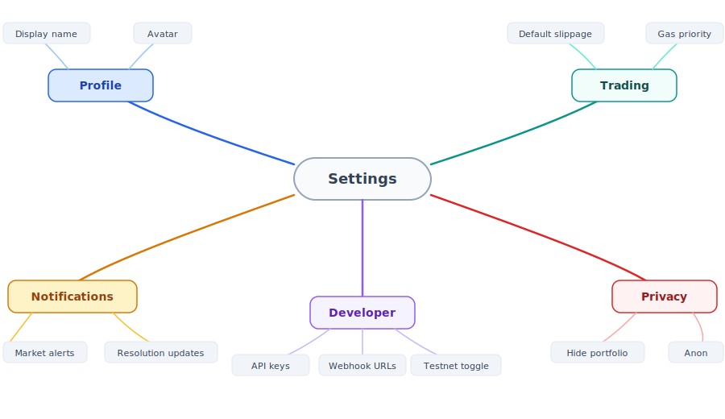
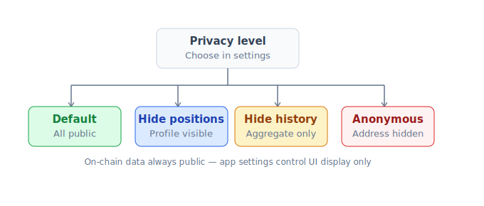

# Settings & i18n

Customize app PrediX theo preference của bạn.

## Settings page

Vào `/settings`.

## Display

| Setting | Options |
|---|---|
| **Theme** | Light / Dark / System |
| **Number format** | 1,234.56 / 1.234,56 / 1 234,56 |
| **Currency display** | USD / EUR / VND / JPY / KRW (chỉ display, internal vẫn USDC) |
| **Time zone** | Auto / manual select |
| **Date format** | YYYY-MM-DD / DD/MM/YYYY / MM/DD/YYYY |

## Language (i18n)

PrediX support 4 ngôn ngữ:

| Language | Code |
|---|---|
| Tiếng Việt | `vi` |
| English | `en` |
| 日本語 | `ja` |
| 한국어 | `ko` |

Đổi: Settings → Language → chọn.

### Localization details

- **UI strings**: full translate qua `next-intl`.
- **Market title + description**: per-market localization. Creator có thể submit translate cho 4 ngôn ngữ. Default fallback English.
- **Error messages**: localized.
- **Help center articles**: localized (priority vi, en).

### Contribute translation

Cộng đồng có thể contribute translation:

1. Fork [github.com/predix-protocol/i18n](https://github.com/predix-protocol/i18n).
2. Edit JSON message file.
3. PR — sau review merge và deploy.

Reward PRX cho high-quality contribution (community grant).

## Trading defaults

| Setting | Default | Range |
|---|---|---|
| **Slippage tolerance** | 0.5% | 0.1% - 5% |
| **Tx deadline** | 5 phút | 1-30 phút |
| **Auto-approve max** | 100 USDC | 0 (always prompt) - unlimited |
| **Confirmation prompts** | Smart (>$50 prompt) | Always / Smart / Never |
| **Default order type** | Market | Market / Limit |

Override per-trade trong UI swap panel.

## Notifications

| Type | Default | Channels |
|---|---|---|
| Order fill | ON | In-app, push |
| Market resolve (your position) | ON | In-app, push, email |
| Price alert (your set) | ON | In-app, push, email |
| Daily digest | OFF | Email |
| Weekly digest | OFF | Email |
| New trader follow | ON | In-app |
| Comment reply / mention | ON | In-app, push |
| Reward / badge | ON | In-app |
| Marketing | OFF | None |
| Governance proposal (vePRX holder) | ON | In-app, email |

### Quiet hours

Tắt push notifications trong giờ specific (e.g. 22:00-07:00). In-app + email vẫn hoạt động.

### Per-market alerts

Setup từng market: Settings → Alerts → Add alert. Hoặc click 🔔 trong market detail.

Chi tiết: [Notifications](../huong-dan/notifications.md).

## Privacy

> **Note**: On-chain data **luôn public**. App settings chỉ control UI level — privacy không hoàn toàn nếu ai đó query indexer / chain trực tiếp.

### Privacy options

| Setting | Effect |
|---|---|
| **Hide active positions** | Profile không show position card |
| **Hide history** | Profile không show trade history |
| **Anonymous mode** | UI dùng pseudonym + custom avatar. Address hide trong UI (vẫn trong URL). |
| **Block list** | Block specific addresses từ comment / mention bạn |
| **Read receipts** | Off receipt khi reply comment |

## Account

### Linked wallets

User có thể link nhiều wallet vào 1 PrediX account:

- Primary: 1 address main.
- Secondary: 0-9 addresses extra.
- All linked addresses share session, settings, preferences.
- Trade từ bất kỳ address nào — UI auto-detect.

Use case: separate hot wallet (passkey) + cold wallet (Ledger) cùng account.

### Email verification

Optional. Verified email cho:
- Receive email digest + critical notifications.
- Recovery option cho passkey loss (Phase 2).
- Preferred contact cho support tickets.

Không verify được — không nhận email notif, vẫn dùng được app.

### 2FA

Phase 2 (TBA): TOTP 2FA cho:
- Withdraw lớn (> $1000).
- Change critical settings (linked wallets, API keys).
- API key creation.

### Sessions

List active session:
- Browser, device, IP, last active.
- **Revoke** — logout session đó (force re-sign in).
- **Revoke all** — invalidate mọi session, sign in lại.

## Developer

### API keys

Quản lý API key cho bot. Chi tiết: [Bots & API](../developers/bots-and-mobile.md).

### Webhooks

Setup HTTP callback for events. Chi tiết: [Bots & API](../developers/bots-and-mobile.md).

### Test mode

Toggle để app dùng testnet endpoint thay mainnet. Useful cho dev test integration.

> Cảnh báo: tx vẫn dùng wallet thật của bạn — chỉ data layer (markets, orders, prices) đến từ testnet.

## Theme customization (Phase 2)

CSS variable override:
- Custom accent color.
- Custom font (web safe).
- Compact / spacious layout.

Save theme JSON, share với community. Power user / DAO branding.

## Export data

`/settings/export`:

- **Trade history** CSV (cho tax / accounting).
- **LP history** CSV.
- **Portfolio snapshot** JSON (point-in-time backup).
- **Account settings** JSON (backup before switch device).

## Delete account

`/settings/account/delete`:

- Off-chain data (pseudonym, email, settings) → deleted from BE.
- On-chain data → **immutable**, vẫn tồn tại trên blockchain.
- Address vẫn dùng được wallet, chỉ không có app account associated.

GDPR / CCPA compliant cho off-chain. On-chain limit của blockchain technology.

## Mobile

Settings trên mobile có 95% feature web. Một số chỉ web (advanced theme custom, bulk import settings).

## Default sane

App ship với defaults sane cho user mới — không cần config gì. Settings chỉ cho ai muốn customize sâu.
